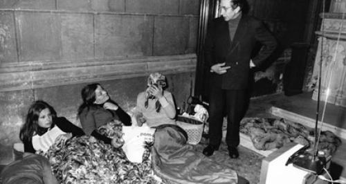

## Les transformations de la sexualité dans les années 1960-1970

Le terme de révolution sexuelle est généralement utilisé pour désigner des transformations profondes dans les sexualités autour des années 1960-1970 en Europe de l’Ouest et en Amérique du Nord. En ce sens, le terme est employé de manière interchangeable avec celui de libération sexuelle, et il renvoie au développement de pratiques sexuelles non-procréatives ainsi qu’à une évolution des normes les rendant plus acceptables. Ces évolutions se manifestent notamment par une baisse de l’âge du premier rapport sexuel, le développement de la sexualité hors mariage, la diffusion de moyens de contraception et de l’avortement, l’insistance sur le plaisir sexuel, l’acceptabilité croissante de l’homosexualité, une plus grande égalité entre les sexes ou encore le développement de mouvements féministes, gays et lesbiens.  

De grandes enquêtes statistiques révèlent en effet une transformation des pratiques sexuelles. Aux Etats-Unis, le rapport Kinsey sur la sexualité des Américains en 1948 et des Américaines en 1953 souligne la diversité des orientations et des pratiques sexuelles. Ce rapport révèle un décalage entre le vécu des individus et les normes sociales, religieuses et morales de l’après-guerre, suggérant que des changements sont en cours. En France, le rapport Simon de 1972 indique une diminution de l’âge du premier rapport sexuel pour les jeunes du début des années 1970 par rapport à la génération précédente, surtout pour les femmes (21,5 ans pour les femmes, 19,2 pour les hommes). Au-delà des pratiques qu’elles révèlent, ces enquêtes témoignent de changements culturels. La sexualité y est traitée comme un objet pouvant légitimement être étudié puis discuté dans l’espace public, ces rapports ayant été très médiatisés. D’autres évènements dans le domaine culturel témoignent d’une évolution des normes sexuelles et de genre : l’assouplissement de la censure permet la parution de productions au contenu plus explicite sur la sexualité, telles que *L’Amant de Lady Chatterley* (republié en version non-censurée en 1960) et *The Joy of Sex* (1972) au Royaume-Uni (Ill. 1), et le film érotique *Emmanuelle* sort en salle en 1974. 

La révolution sexuelle se joue enfin dans le champ politique. De nombreuses normes juridiques encadrant le mariage et la sexualité évoluent en France, de la loi Neuwirth de 1967 sur la contraception à l’évolution de la qualification juridique du viol en 1980. Ces changements résultent de mobilisations militantes, avec le développement du Mouvement de Libération des Femmes (MLF), du Front Homosexuel d’Action Révolutionnaire (FHAR), des Gouines Rouges et de la mobilisation des travailleuses du sexe à Lyon en 1975 (ill. 2, 3, 4).

## La révolution sexuelle existe-t-elle ?

Cette révolution sexuelle se jouerait donc sur les plans social, culturel et politique, mais les chercheuses et chercheurs débattent de l’importance à donner à ces différentes dimensions. Dans les représentations communes, la mini-jupe du Londres des Swinging Sixties, la contre-culture hippie du Summer of Love californien de 1967 et la sortie du film *Emmanuelle* sont presque devenus des symboles d’une révolution sexuelle. Pour autant, ces éléments culturels ne révèlent pas nécessairement une révolution des pratiques, notamment en dehors des milieux militants ou urbains. Des historiennes et historiens suggèrent que le changement aurait été davantage culturel que social, avec une évolution des représentations et des discours plus que des pratiques intimes. 

L’idée qu’une révolution aurait soudainement libéré une sexualité précédemment réprimée est aussi remise en cause par des travaux montrant la variété des pratiques sexuelles avant les années 1960, ou insistant sur la « libéralisation des mœurs » sur le temps long (Anne-Marie Sohn). Ces critiques du concept analytique de révolution sexuelle s’appuient sur les travaux de Michel Foucault qui a souligné les limites de l’opposition répression/libération pour analyser l’évolution des normes et pratiques sexuelles. Foucault considère au contraire que la sexualité est structurée par des normes qui se reconfigurent.

Nombre de travaux critiques en histoire et en sociologie ont montré que de nouvelles injonctions sont apparues dans la deuxième partie du xxe siècle, notamment celle de la disponibilité du corps des femmes. Les femmes seraient confrontées à l’injonction contradictoire d’être sexuellement libérées tout en maintenant une image de respectabilité et de retenue, sous peine d’être stigmatisées. La révolution sexuelle serait donc davantage celle des hommes hétérosexuels, qui gagneraient alors une diversité de partenaires. La révolution sexuelle a aussi été jugée responsable d’une injonction à la jouissance, symbolisée par le slogan de Mai 68 « Jouissez sans entraves », ou encore d’un renforcement des logiques de marché dans les relations sexuelles. Dans le contexte de #MeToo et #MeTooinceste, l'attention s'est enfin portée sur la question des violences dans la révolution sexuelle : les rapports de domination ont persisté dans les années 1960-1970, et la rhétorique de la libération sexuelle a notamment pu être utilisée pour justifier la pédophilie et l’inceste.

Les rapports entre pouvoir et sexualité recouvrent également des enjeux liés à la race. La rhétorique d’une modernité sexuelle battant en brèche le conservatisme, notamment religieux, aurait participé, dans les pays du Nord, à stigmatiser des populations immigrées parfois moins sécularisées. Todd Shepard a aussi montré comment la révolution sexuelle, notamment homosexuelle, s’était nourrie de projections néocoloniales sur les hommes arabes, érotisant une altérité exotique. Enfin, la chercheuse Myriam Paris montre que la question des droits sexuels et reproductifs n’est pas également traitée en fonction de la classe et de la race dans les années 1960 : alors que des politiques natalistes sont promues en France métropolitaine, des politiques de limitation de la natalité, notamment forcées, sont appliquées à la Réunion.

## La révolution sexuelle, un concept politique historiquement situé

Le terme de « révolution sexuelle » n’est pas seulement un concept analytique pour désigner les phénomènes des années 1960-1970. Il s’agit également d’un concept plus ancien, politique cette fois, qui renvoie à l’idée que la révolution devrait libérer la sexualité, ou que la sexualité aurait un pouvoir révolutionnaire. 

La révolution russe de 1917 fait naître l’espoir de combiner communisme et libération de la sexualité grâce à la légalisation de l’avortement, la dépénalisation de l’homosexualité et la défense de l’amour libre, notamment dans les ouvrages de la communiste et féministe Alexandra Kollontaï (1872-1952). Si l’URSS enterre l’espoir d’une révolution sexuelle soviétique en abandonnant nombre de lois progressistes au fil des années 1920, les discussions sur la révolution sexuelle se poursuivent dans plusieurs pays européens. Le terme est alors mis en avant par le médecin et psychanalyste communiste autrichien Wilhelm Reich (Die Sexualität im Kulturkampf, 1936, traduit sous le titre La Révolution Sexuelle) et par le socialiste français Émile Armand (La Révolution sexuelle et la camaraderie amoureuse, 1934). C’est aussi l’époque de la création de la Ligue mondiale pour la réforme sexuelle (1921-1932) qui milite pour des réformes législatives sur les questions sexuelles, du développement de la sexologie, et d’intenses théorisations communistes, marxistes et anarchistes. 

Entre les années 1950 et 1970, les textes de Reich circulent et de nouvelles figures tutélaires émergent, comme le philosophe Herbert Marcuse (1898-1979) qui affirme que la sexualité est réprimée par la société capitaliste. Leurs idées se répandent d’abord dans des milieux anarchistes et communistes opposés aux partis communistes européens et au régime soviétique, ceux-ci perpétuant une morale sexuelle qu’on peut qualifier de conservatrice, avant d’atteindre les milieux étudiants autour du moment 68. En France, en témoignent par exemple l’ouvrage du communiste libertaire et militant homosexuel Daniel Guérin Essai sur la révolution sexuelle après Reich et Kinsey (1969) et les nombreux graffitis revendiquant la liberté sexuelle en Mai 68 (ill. 5).

## Bibliographie

Paris, Myriam, « La racialisation d’une politique publique : le contrôle de la natalité à La Réunion (années 1960-1970) », *Politix*, 131/3 (2020) : 29-52.

Plaquevent, Blanche, « Penser la révolution sexuelle dans les années 1960 : intellectuel·le·s et étudiant·e·s en quête de subversion », *Ethnologie française*, vol. 49/2, 2019, p. 277-292. 

Rebreyend, Anne-Claire, *Intimités amoureuses : France, 1920-1975*, Toulouse, Presses universitaires du Mirail, 2008.

Révenin, Régis, *Une histoire des garçons et des filles : amour, genre, sexualité dans la France d’après-guerre*, Paris, Vendémiaire, 2015.

Ruault, Lucile, « Libération sexuelle ou “pression à soulager ces messieurs” ? Points de vue de femmes dans les années 68 en France », *Ethnologie française*, vol. 49/2, 2019, p. 373-389.

Shepard, Todd, *Mâle décolonisation. L’« Homme arabe » et la France, de l’indépendance algérienne à la révolution iranienne*, Paris, Payot, 2017.

Shield, Andrew DJ, *Immigrants in the Sexual Revolution: Perceptions and Participation in Northwest Europe*, Londres, Palgrave McMillan, 2017.
