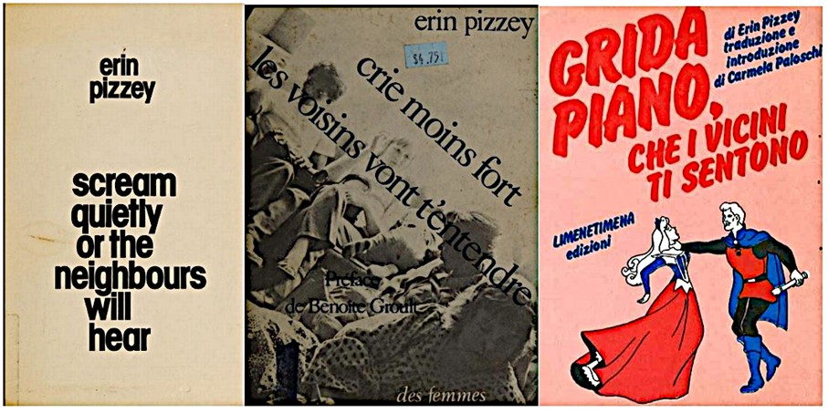

Du 4 au 8 mars 1976, le palais des Congrès de Bruxelles accueille 2 000 femmes venues du monde entier assister au Tribunal international contre les crimes faits aux femmes !

[Ill. 1 : Affiche du Tribunal des crimes contre les femmes, Bruxelles, 4 au 8 mars 1976. Source : Ville de Paris / Bibliothèque Marguerite Durand, AFF 149 m](crimefemme.jpeg) 

Cette initiative vise l’identification et la dénonciation féministe des violences faites aux femmes, définies dans une acception large, aussi bien sexuelle, familiale, médicale qu’économique, culturelle et politique.
 
 
 Pour faire de cette multiplicité de situations un problème politique cohérent, les féministes développent des outils théoriques, pensent leur rôle dans la perpétuation de la domination masculine ou inventent des concepts. Dans les années 1980, la sociologue britannique Liz Kelly (1951-) utilise celui de continuum de la violence sexuelle pour penser tant la variété et l’étendue des violences auxquelles les femmes sont confrontées au cours de leur vie que les liens entre ces différentes formes de violence. Ce rapprochement passe aussi par la circulation d’idées et de modes d’action aux échelles européennes et internationales. Selon les lieux, les premières mobilisations se sont focalisées sur certains sujets emblématiques, comme le viol ou les violences conjugales.

## La cause des « femmes battues »

Au Royaume-Uni, le mouvement féministe se saisit dès 1971 de la cause des victimes de violences conjugales, désignées alors comme des « femmes battues ». Un collectif de femmes du quartier londonien de Chiswick ouvre un premier refuge appelé Women’s Aid. D’autres apparaissent ensuite sous le même nom et se fédèrent à l’échelle nationale en 1974. Parmi les initiatrices du refuge de Chiswick, Erin Pizzey (1939-) se distingue par ses efforts pour médiatiser l’expérience. Elle publie en 1974 Scream Quietly or the Neighbours Will Hear, un recueil de témoignages largement diffusé et adapté en documentaire pour la télévision. Toutefois, au sein du mouvement britannique, Pizzey est contestée pour ses prises de position antiféministes, hostiles à la libération lesbienne, et parce qu’elle prône une gestion centralisée des refuges que ses opposantes considèrent comme non démocratique. Son analyse des violences par la psychologie plutôt qu’en dénonçant la famille patriarcale est aussi critiquée.

Elle devient pourtant une figure de référence à l’étranger. Les traductions de son livre, en français (1975), néerlandais (1975), allemand (1976), italien (1977) ou danois (1979), en font un texte canonique du féminisme de la deuxième vague. 

. 
Des féministes étrangères visitent le refuge londonien et s’en inspirent, comme à Blijf van mijn lijf (Touche pas à mon corps), ouvert à Amsterdam fin 1974. Accompagnée de femmes et d’enfants résidant à Chiswick, Pizzey entreprend, au printemps 1975, une tournée à Amsterdam, Bonn, Bruxelles et Paris, à la recherche de soutiens institutionnels et militants. À cette occasion, la Ligue du droit des femmes, une association féministe parisienne, commence à s’approprier la question des violences conjugales. Elle ouvre une permanence téléphonique, puis un refuge en 1978, un an après le premier refuge belge.

## Dénoncer le viol, apprendre à se défendre

Dans certains espaces, la lutte contre le viol est investie avant la question des violences conjugales. Les premières publications du Mouvement de libération des femmes parisien dénoncent le viol, comme « Le viol », écrit par Emmanuèle de Lesseps (1946-) dans *Partisans* en 1970 et qui le raconte à la première personne. La cause prend de l’ampleur en France à partir du milieu des années 1970 : les féministes françaises diffusent dans la presse un Manifeste contre le viol en 1976, soulignant qu’il s’agit de « la réalité quotidienne des femmes dans les rues, dans leurs maisons, à leur travail, en vacances, le jour, la nuit ». Le foyer familial est alors identifié comme un cadre possible de violence, aux côtés du lieu de travail ou de l’espace public. En 1978, des mobilisations ont lieu autour du procès d’Aix-en-Provence sur le viol de deux touristes belges lesbiennes dans une calanque marseillaise. En Italie, c’est le viol collectif de deux adolescentes et le meurtre de l’une d’elles en 1975, à Circeo près de Rome, qui lance une campagne féministe et donne plus de visibilité aux violences sexuelles.

Contre ces violences, en particulier celles qui ont lieu dans la rue, les féministes se dotent d’un nouvel outil : la marche de nuit.

](marches.jpg). 

Cette réappropriation collective de l’espace public est utilisée pendant le Tribunal de Bruxelles, reprise à Rome et à Berlin en 1976, dans plusieurs villes d’Allemagne de l’Ouest le 30 avril 1977, ou à Londres et Leeds cette même année 1977. Ces manifestations souvent festives s’accompagnent d’actions parfois spectaculaires, des graffitis dénonçant le viol au collage d’affiches accusant nommément des violeurs, en passant par les dégradations de commerces considérés comme participant de la culture du viol. À Leeds, la mobilisation a été avivée par une série de treize meurtres de femmes, dont des travailleuses du sexe, commis entre 1975 et 1980 par un même homme. Un groupe, Angry Women, s’y démarque par sa virulence : dix-sept incendies de sex-shops lui sont attribués en 1983.

Enfin, l’autodéfense féministe émerge pour donner aux femmes des éléments de réponse individuelle. Certaines déclinaisons circulent internationalement par le biais de voyages de formatrices : les militantes d’Europe de l’Ouest s’approprient le Fem Do Chi et le Wendo québécois ou le Seito Boei autrichien au cours de stages.

## Sexualité et violence : une articulation débattue

Les modalités de lutte féministe contre les violences font parfois débat. Le recours à la justice et aux forces de l’ordre divise, aussi bien au sein des mouvements féministes qu’entre féministes et organisations d’extrême-gauche. Début 1978, lors d’un procès pour viol à la cour d’assises du Mans, les avocates de la victime réfutent l’utilité de l’emprisonnement de l’accusé et le public féministe appelle, à l’issue de sa condamnation, à sa libération. L’objectif est, par le procès, de dénoncer un fait social sans accentuer sa répression pénale. Ces mobilisations participent aussi à la redéfinition des catégories légales, comme celle du viol dans la loi française, qui devient en 1980 « tout acte de pénétration sexuelle, de quelque nature qu'il soit, commis sur la personne d'autrui, par violence, contrainte ou surprise ».

Toutes les féministes ne se rallient pas à un mouvement de politisation qui pense ensemble viols, agressions, harcèlement, objectification et marchandisation de la sexualité. Des divergences majeures apparaissent parmi les théoriciennes et militantes qui s’approprient certains des débats des « sex wars » états-uniennes. Ces conflits portent sur la possibilité de subvertir certaines pratiques sexuelles, comme la pornographie ou le sadomasochisme, pour en faire un outil de libération. La dénonciation de la pornographie comme une violence faite aux femmes est ainsi plus investie par les féministes norvégiennes, suédoises ou allemandes que par les Françaises au début des années 1980. Au Royaume-Uni, la question des subcultures sadomasochistes lesbiennes ouvre un débat particulièrement conflictuel sur les rapports entre sexualité, pouvoir et consentement.

Enfin, certains angles morts des mobilisations sont dénoncés. Des féministes antiracistes critiquent les effets stigmatisants du passage des marches de nuit britanniques dans des quartiers populaires où vit une importante population noire ou contestent la manière dont certaines se saisissent de la question de l’excision. En France, des écrivaines comme Benoîte Groult ou Awa Thiam, et des collectifs dont la Coordination des femmes noires, voient dans cette pratique une violence faite aux femmes à partir de 1975. Dans d’autres pays, la Conférence des Nations Unies sur les femmes de Copenhague de 1980 donne de l’ampleur au débat. La démarche de l’États-unienne Fran Hosken (1919-2006), qui popularise l’appellation « mutilations génitales féminines », y est dénoncée comme étant condescendante et sensationnaliste par des féministes arabes et africaines, dont l’écrivaine égyptienne Nawal El Saadawi (1931-2021). À Copenhague comme au Tribunal de Bruxelles, les termes des débats féministes ouest-européens informent et s’informent de circulations de personnes, d’idées et de causes véritablement mondiales.

## Bibliographie

Bérard, Jean, *La justice en procès. Les mouvements de contestation face au système pénal (1968-1983)*, Presses de Sciences Po, 2013.

Delage, Pauline, *Violences conjugales. Du combat féministe à la cause publique*, Presses de Sciences po, 2017.

Giacinti, Margot, « Le Tribunal international des crimes contre les femmes (mars 1976). Un moment-clé dans la conceptualisation du féminicide ? », *Cahiers du Genre*, no 73, 2022, p. 85‑110.

Korsvik, Trine Rogg, *Politicizing Rape and Pornography. 1970s Feminist Movements in France and Norway*, Palgrave Macmillan, 2020.

Simic, Zora, « From Battered Wives to Domestic Violence: The Transnational Circulation of Chiswick Women’s Aid and Erin Pizzey’s Scream Quietly or the Neighbours Will Hear (1974) », *Australian Historical Studies*, vol. 51, no 2, 2020, p. 107‑126.
