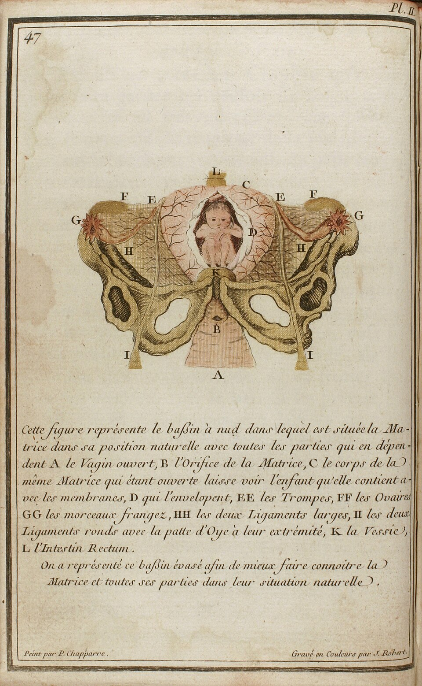
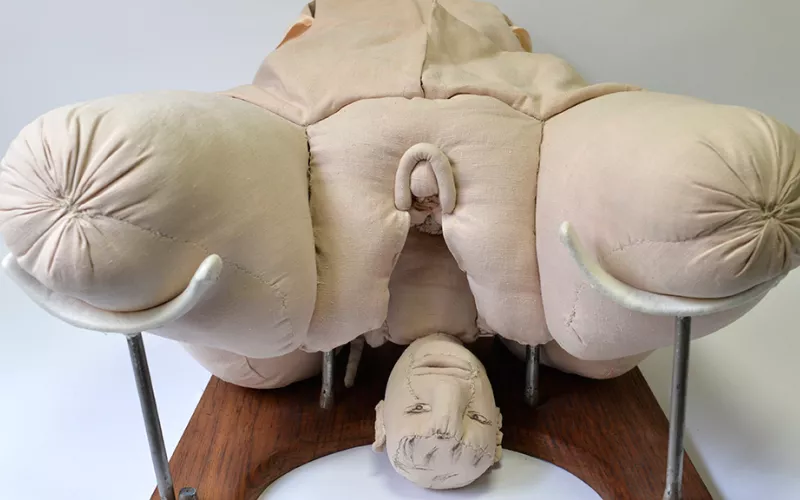

Cette notice est le fruit d'un entretien avec Emmanuelle Berthiaud. Propos recueillis par Irène Gimenez, Sara Legrandjacques et Juliette Milleron. 

## Un parcours exceptionnel de sage-femme et de formatrice

](Angélique_du_Coudray_by_Le_Villain_after_Lecler.png)

Angélique Marguerite Le Boursier du Coudray (autour de 1712-1792 ; ill. 1) grandit dans une famille de la petite bourgeoisie auvergnate. Elle se forme à Paris à partir de 1737, auprès d’une sage-femme jurée du Châtelet, une modalité de formation qui existe depuis la fin du Moyen Âge. Il était également possible, pour une minorité de sages-femmes, d’apprendre le métier auprès d’une maîtresse sage-femme à l’Office des accouchées de l’Hôtel-Dieu de Paris ou à la maternité de Strasbourg. Après deux ans d’apprentissage, Angélique du Coudray réussit son examen devant des chirurgiens en 1739 et devient sage-femme jurée en 1740. Ce diplôme lui ouvre le droit d’être rémunérée en échange de ce travail. Elle exerce une quinzaine d’années auprès de la bourgeoisie parisienne. Alors que la majorité des sages-femmes formées reste dans les centres urbains, elle revient s’établir en Auvergne à la demande d’un seigneur de Thiers.

Elle observe alors, dans les campagnes, la mortalité infantile et maternelle, ainsi que le manque de formation des accoucheuses traditionnelles, ces « matrones » au savoir-faire empirique, mobilisées dans les réseaux de voisinage sans qu’il s’agisse d’un métier. Angélique du Coudray met alors au point une méthode pédagogique originale, reconnue par un brevet royal en 1759 qui lui ouvre le droit d’aller enseigner l’art des accouchements dans les provinces françaises. À cette période, l’accouchement devient un enjeu de santé publique et de gestion des populations : la mortalité des mères et des enfants devient intolérable pour les élites politiques et médicales, pour les curés qui enregistrent les décès des nourrissons, mais aussi pour les femmes qui ne résignent plus à mourir en couches, témoignant ainsi d’un changement global des mentalités.

Angélique du Coudray dispense des cours itinérants de 6 à 8 semaines en moyenne, dans un tour de France qu’elle entreprend jusqu’en 1783. Le mannequin pédagogique en taille réelle qu’elle conçoit est reconnu par l’Académie de médecine en 1758. Ce travail lui assure rémunération et reconnaissance, par l’intermédiaire notamment d’une pension royale. Après sa retraite, sa nièce, Marguerite Coutanceau, poursuit ces formations.

Angélique du Coudray n’est pas la première sage-femme renommée – elle succède par exemple à Louise Bourgeois (1563-1636), sage-femme de Marie de Médicis et autrice d’ouvrages d’obstétrique – et elle participe à une [dynamique de professionnalisation et de consolidation des savoirs et des savoir-faire autour de la naissance en Europe](https://ehne.fr/fr/encyclopedie/th%C3%A9matiques/genre-et-europe/de-la-transition-d%C3%A9mographique-aux-r%C3%A9volutions-sexuelles/les-sages-femmes-en-europe), comme en témoigne l’anglaise Elizabeth Nihell (1723-1776) ou l’allemande Justine Siegemundin (1636-1705). Son parcours est toutefois exceptionnel du fait de ce rôle de formatrice en dehors de structures hospitalières et de la reconnaissance nationale qu’elle obtient comme enseignante et maîtresse sage-femme.

## Une méthode pédagogique originale : former les sages-femmes en se mettant à leur portée

L’expertise d’Angélique du Coudray n’est pas liée à son expérience directe puisqu’elle n’a pas connu la maternité. Sa méthode possède un versant théorique, par le manuel qu’elle publie visant à transmettre des connaissances anatomiques de base avec de nombreuses planches illustrées en couleurs (ill. 2), et un versant pratique, par la démonstration puis la manipulation du mannequin d’accouchement (ill. 3). 

Le mannequin, modulable en volume et en forme grâce à des rubans, reproduit différents stades de la grossesse, l’ampliation du vagin, la topographie des viscères, les fœtus à différents degrés de maturité, avec tous les détails anatomiques : crâne avec des fontanelles, cordon, colonne vertébrale souple avec vertèbres. Les élèves apprennent ainsi à reconnaître par le toucher les différentes présentations de l’enfant, à effectuer des manœuvres ou à diagnostiquer les cas de mort in utero. L’un des enjeux est de savoir reconnaître un accouchement dystocique afin de savoir quand appeler à l’aide. Ses cours passent par la répétition et l’oral, en accompagnant les gestes par la parole. Les premiers soins à apporter aux mères et aux enfants – post-partum et puériculture – en font partie.

Sur la demande des intendants, Madame du Coudray se déplace dans les généralités, accompagnée d’un groupe de 6 à 8 personnes, composé de domestiques et d’assistants, dont sa nièce. Elle forme des sages-femmes, probablement autour de 5 000, et des démonstrateurs – uniquement des hommes – qui prennent la suite de son enseignement. Lors de chaque déplacement, elle demande l’achat de son manuel et de mannequins dédiés à la manipulation et à la démonstration (environ 200-300 livres, soit le revenu moyen d’un salarié agricole au 18e siècle) afin de mener à bien ses enseignements auprès d’une ou plusieurs dizaines d’élèves. Les mannequins sont fabriqués à partir d’un mannequin modèle (environ 500 livres). Ce matériel reste sur place pour pérenniser la formation. Dans la généralité de Reims dans les années 1770, le coût de son passage est estimé à 8 000 livres. 

Si sa méthode part de la dénonciation de l’ignorance des accoucheuses – une critique fréquente sous la plume des chirurgiens qu’elle reprend à son compte –, ces matrones ne constituent pas le public de ses formations car elles sont souvent âgées et jugées incapables d’être formées. Puisque le matériel, l’hébergement à la ville et les repas sont assurés par les autorités (la formation est donc gratuite pour les femmes qui y participent), celles-ci recrutent plutôt des femmes jeunes (20-25 ans), de préférence célibataires et sans enfant ou famille à charge, idéalement sachant lire et écrire (même si beaucoup ne le savent pas). Le profil des élèves varie selon les régions mais les autorités locales font des capacités d’apprentissage et de la bonne moralité des critères essentiels. L’agrément du curé est ainsi indispensable. À l’issue de la formation et après examen, les élèves reçoivent un certificat, ce qui suscite l’opposition de certains chirurgiens qui défendent leur monopole à délivrer des diplômes et à intervenir lors des accouchements difficiles.

## Réception et effets des enseignements de Mme du Coudray

La science obstétricale qui apparaît à la fin du 17e siècle tend à être accaparée par les chirurgiens. Ceux-ci ont un accès privilégié à l'instrumentation, comme le forceps. S’il ne faut pas opposer frontalement sages-femmes et accoucheurs, des concurrences professionnelles existent et s’accroissent même avec la mise en œuvre d’une politique de formation. La médicalisation s’accompagne d’une masculinisation de l’encadrement de la naissance. L’outil pédagogique de Mme du Coudray est ainsi capté par les accoucheurs, ce qui leur permet d’avoir la mainmise sur la formation des sages-femmes.

Bien qu’il s’agisse d’une démarche patronnée par l’État royal et ses relais en province, les sources administratives et les correspondances donnent à voir certaines tensions et des réticences locales de la part de certains chirurgiens qui se sentent mis en concurrence. Angélique du Coudray est décrite comme vaniteuse, parce qu’elle réclame de l’argent en échange de ses compétences, selon un évident préjugé de genre.

Les enquêtes démographiques montrent qu’il y a eu une réduction de la mortalité infantile et maternelle là où se sont déroulés les cours. Dans la généralité de Rouen, le taux de mortalité pour les accouchements avec une sage-femme est de 6,28 pour mille alors qu’il est de 10,06 avec les matrones. Ces sages-femmes formées ne remplacent pas immédiatement et partout les accoucheuses traditionnelles, notamment dans les campagnes. Le renouvellement des praticiens de la naissance et la médicalisation de celle-ci se font de manière progressive et sur la longue durée.

Dans les années 1770-1780, avec le développement de la formation, le profil des sages-femmes se renouvelle : elles sont plus jeunes, plus instruites, issues d’un milieu plus favorisé. Elles deviennent des professionnelles rémunérées qui ne pratiquent plus seulement de manière occasionnelle. À la croisée entre obstétrique savante et populaire, les sages-femmes ont été un instrument essentiel de médicalisation de la société. Elles introduisent une nouvelle conception de l’accouchement et du corps et ont contribué aussi à la diffusion de l’inoculation et des règles d’hygiène au 19e siècle.

## Bibliographie

La « machine » de Madame du Coudray, ou l’art des accouchements au XVIIIe siècle, Rouen, éd. Point de vue, musée Flaubert d’histoire de la médecine, 2004.

Emmanuelle Berthiaud, [*« Attendre un enfant » : Vécu et représentations de la grossesse aux XVIIIe et XIXe siècles (France)*](https://theses.hal.science/tel-02517796/), thèse de doctorat, UPJV, Amiens, 2011.

Emmanuelle Berthiaud, [« Représenter l’irreprésentable ? L’accouchement et ses douleurs (XVIIe-XIXe siècles) »](https://laviedesidees.fr/Representer-l-irrepresentable), *La Vie des idées*, 28 février 2025.

Jacques Gélis, *La sage-femme ou le médecin. Une nouvelle conception de la vie*, Paris, Fayard, 1988.

Nathalie Sage Pranchère, *L’école des sages-femmes. Naissance d’un corps professionnel (1786-1917)*, Tours, Presses universitaires François-Rabelais, 2017.
