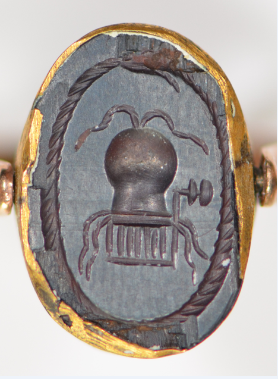

Les discours antiques sur la médecine participent à construire les corps et le genre. En très grande majorité rédigés par des hommes à destination d’autres hommes, ils font généralement du corps masculin le corps de référence et du corps féminin le lieu de la reproduction. Dans la culture occidentale qui a reçu et transmis ces textes, Hippocrate tout d’abord – à qui est associée une série de textes anonymes composés aux Ve-IVe s. av. J.-C., regroupés communément sous l’appellation de « corpus hippocratique » – puis Galien (IIe s.), servent de figures tutélaires.

## Genre, différence sexuelle et procréation

L’attention à la différence sexuelle est particulièrement marquée dans les discours qui traitent de la formation de l’embryon, mais elle se manifeste aussi dans les différents modèles physiologiques et anatomiques que ces textes véhiculent. Le couple homme/femme – mâle/femelle au stade embryonnaire – recoupe des oppositions binaires : gauche-droite, froid-chaud, humide-sec, mou-dur, lent-rapide, etc. Le féminin est en général associé à l’élément jugé négatif. Les considérations d’Aristote (IVe s. av. J.-C.) sur l’infériorité ontologique des femmes ont été reprises en partie par Galien : la disposition identique mais inversée des organes génitaux, à l’extérieur pour les mâles, à l’intérieur pour les femelles, est pour lui l’indice de l’imperfection et de l’inachèvement de la femelle par rapport au mâle, qu’Aristote voyait auparavant dans les règles, assimilées à du sperme non cuit.

Dans le cadre de la médecine hippocratique qui pense la santé comme un équilibre entre différentes humeurs en mouvement dans le corps, la physiologie des hommes et des femmes n’apparaît pas foncièrement différente : le modèle commun de l’évacuation et de la circulation des fluides sert de cadre pour les deux sexes. Pour l’historien Thomas Laqueur, la médecine grecque a ainsi forgé un modèle du corps « unisexe », resté valable jusqu’au XVIIIe siècle, mais d’autres spécialistes voient dans l’attention portée par la médecine grecque antique à la « matrice » ou « utérus » (*mètrè/hystérè* en grec) l’indice d’une conception du corps féminin comme fondamentalement autre. Dans cette perspective, l’utérus fonctionne comme métonymie de la femme et dicte la plupart de ses affections. Le volet médical de la différence sexuelle consiste alors à se demander si les femmes, parce qu’elles possèdent un utérus susceptible d’influencer leur « nature » toute entière, ont des maladies propres, et s’il faut traiter ces dernières comme des maladies masculines ou les confiner à une branche particulière de la médecine. Ces questions sur le propre des femmes et la nécessité d’un traitement différencié circulent dans les milieux savants et ne font pas l’unanimité. Soranos d’Éphèse (Ier s.), auteur d’un traité sur les « maladies des femmes », répond à l’ensemble par la négative : détachant la santé des femmes de la question reproductive, il affirme que les parties du corps sont les mêmes chez les deux sexes, que l’utérus n’est pas essentiel à la vie et que les grossesses répétées sont dangereuses pour les femmes. 

La répartition genrée des rôles dans la reproduction intéresse aussi les discours médicaux. Les auteurs du corpus hippocratique et Galien reconnaissent l’existence d’une « semence » ou d’un « sperme » (*sperma* en grec) féminin. Le traité hippocratique *Génération–Nature de l’enfant* élabore un modèle pangénétique : la semence du parent provient de toutes les parties du corps. L’attention aiguë à la reproduction colore le discours médical sur la sexualité, envisagée comme une prophylaxie : l’hygiène sexuelle constitue une part importante du régime général de l’individu pour être en bonne santé et le coït est prescrit pour l’équilibre des humeurs. En revanche, même si la stérilité masculine n’est pas ignorée, la charge de la fécondité revient surtout à la femme, à qui il est par exemple conseillé, dans les traités gynécologiques hippocratiques, d’aller coucher avec son mari pour vérifier que le traitement contre la stérilité a fonctionné.

## Genre des maladies, genre de l’expertise médicale

Au sein d’une conception multifactorielle de la maladie, le genre compte : les traités hippocratiques des *Épidémies* témoignent de la prise en compte par le médecin itinérant des expériences sexuées des patientes, qu’il répertoriait dans ses comptes rendus sans pour autant établir de véritable distinction dans le diagnostic ou la thérapie. Ces traités confirment également, comme le laissent penser le Serment hippocratique puis les écrits de Galien, que les hommes médecins examinaient parfois les corps des femmes, quand les obstacles relatifs à la pudeur autour des *gynaïkéia* (« les choses des femmes ») et aux barrières sociales entre hommes et femmes étaient levés. En revanche, malgré l’identification par Hérophile de Chalcédoine (IIIe s. av. J-C) des ovaires et des trompes de Fallope, la dissection de corps humains n’était pas la source principale du savoir sur les femmes transmis par ces médecins, qui devaient nécessairement s’appuyer sur la parole des concernées ou comparer avec les corps animaux, plus fréquemment disséqués. 

Ils recouraient également à bon nombre de spéculations, dont témoigne l’imaginaire associé à l’utérus, qui persiste jusqu’à la Renaissance – matrice-ventouse et fermée par des clés (ill. 1), animal capricieux chez Arétée de Cappadoce (Ier s.), utérus-poulpe chez Galien ... 

Certaines descriptions anatomiques, particulièrement chez Galien, deviennent ainsi des tours de force rhétoriques où l’objet étudié finit par disparaître derrière le filtre des différentes images convoquées. L’imaginaire de la matrice errante, rendu célèbre par le Timée de Platon (IVe s. av. J.-C.), a quant à lui entraîné des projections rétrospectives sur les déplacements de la matrice décrits dans le corpus hippocratique qui servirent de socle à la construction de l’hystérie au XIXe siècle.

Est-il possible de retrouver la voix, les gestes et l’expertise des femmes dans ce champ dominé par le point de vue des hommes ? Certaines études ont envisagé que les auteurs masculins avaient intégré des savoirs féminins dans leurs écrits, notamment concernant la pharmacologie. De fait, la plupart des recettes thérapeutiques hippocratiques figurent dans les écrits consacrés aux maladies des femmes. D’autres études font valoir qu’aucun indice probant ne va dans ce sens, et que cette conception repose sur une représentation faussée de la répartition du champ de compétences entre hommes et femmes : aux premiers, les savoirs rationnels et théoriques, aux secondes, les savoirs empiriques liés à la sphère domestique.

Les textes contiennent bien la trace de l’expertise des femmes sur leur propre corps : il arrive qu’un auteur affirme tirer son savoir de la parole des femmes, parfois citées nommément (Antiochis ou Spendosa chez Galien), ou que leurs paroles et gestes participent au diagnostic puis à la thérapie (Phrontis chez Hippocrate). Certains corpus médicaux de langue grecque ou traduits du grec ont même été attribués à des femmes : les *Gynaecia Cleopatra* (IVe s.) se présentent comme une compilation de sources grecques traduites en latin, dans lesquelles figurerait un traité gynécologique attribué à une dénommée Cléopâtre. Des textes attribués à une certaine Métrodôra compilent également des extraits d’un traité intitulé Sur les maladies de la matrice, rédigé sans doute bien après notre période (VIe-IXe s.) mais dont le contenu ne rompt pas avec les traditions gynécologiques précédentes.

Il est aujourd’hui avéré que l’expertise médicale des femmes ne s’arrêtait pas à leur propre corps : des inscriptions grecques, des papyrii ou de brèves mentions textuelles montrent que des femmes exerçaient une activité thérapeutique qui n’était pas seulement destinée à d’autres femmes – loin de l’alternative entre la sage-femme et l’experte en drogues dont on peine à se débarrasser. Une stèle macédonienne sans inscription (ill. 2) montre par exemple que certaines femmes ont peut-être exercé dans de véritables cabinets : la femme est à gauche, identifiée par Constantinos Moschakis à une praticienne dont l’activité serait définie par les objets qui l’entourent.

## Bibliographie

BONNEAU, Marion, « Hippocrate, premier gynécologue de l’histoire occidentale ? Polyphonie du discours hippocratique sur la médecine des femmes », *Littérature* n°219, 2025, p. 12-24.

DASEN, Véronique et KING, Helen, « Les femmes et la médecine antique », dans *La médecine dans l’antiquité grecque et romaine*, Éditions BHMS, 2008, p. 59-65.

DASEN, Véronique, « L’ars medica au féminin », *Eugesta*, n°6, 2016, p. 1-40.

MAHOU, Stéphanie et PIETROBELLI, Antoine, « Anatomie et physiologie du système reproducteur féminin d’Hippocrate à Galien », dans PERDICOYIANNI-PALEOLOGOU, Hélène (ed.), *The nature of woman and social aspects of motherhood in the Greco-Roman Antiquity*, Amsterdam, Verlag Adolf M. Hakkert (Byzantinische Forschungen. Band XXXIV), 2025.

HANSON, Ann Ellis, « La femmes des auteurs médicaux », dans HALPERIN, David , WINCKLER, John et ZEITLIN, Froma  (dir.), *Bien avant la sexualité : l’expérience érotique en Grèce ancienne*, Éditions Epel, 2019 [1990], p. 395-434.
