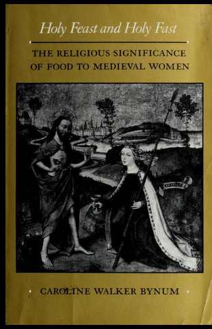

---

title: "La nourriture et les femmes au Moyen Âge, un enjeu de sainteté ?"
author: 
    - Hannah Victoria Johnson

tags:
    - histoire/civilisation
    - littérature/linguistique
    - Moyen Age
    - corps
    - anthropologie
    - croyances/spiritualités
    - partenariat EHNE

abstract: "L’ouvrage *Holy Feast and Holy Fast* de Caroline Walker Bynum (University of California Press, 1987) cherche à comprendre un phénomène spirituel du Moyen Âge tardif (12e-15e siècle) : la place de la nourriture dans les expériences et pratiques dévotionnelles des femmes mystiques en Europe occidentale. Il réintroduit les femmes en tant qu’autorités spirituelles du Moyen Âge et réinvestit le savoir corporel comme outil légitime à la fois pour faire de la théologie au Moyen Âge et pour les historiens et historiennes qui déchiffrent cette théologie."
---

## Les femmes mystiques et la nourriture au Moyen Âge : un moyen d’accéder à Dieu

*Holy Feast and Holy Fast*, écrit par l’historienne états-unienne Caroline Walker Bynum, interroge l’importance de la nourriture au sein de la spiritualité féminine du Moyen Âge tardif en Europe occidentale. Il a été traduit en français en 1994 par Claire Forestier Pergnier et Éliane Utudjian Saint-André sous le titre *Jeûnes et festins sacrées : les femmes et la nourriture dans la spiritualité médiévale*.

Cet ouvrage montre le lien entre la culture culinaire autour des festins religieux (repas pour les fêtes religieuses, eucharistie) et certains phénomènes spirituels chrétiens qui s’installent à partir du 12e siècle chez les femmes mystiques. Les mystiques médiévaux (hommes ou femmes) sont des personnes qui reçoivent des visions de Dieu qu’elles mettent à l’écrit souvent sous un style hautement poétique. Ces textes témoins d’un contact intime et didactique entre l’humain et son Dieu sont révélateurs de pratiques spirituelles, expériences de spiritualité et courants théologiques (la transsubstantiation eucharistique, l’union spirituelle avec Dieu, etc.). *Holy Feast and Holy Fast* met en évidence les différentes manières dont les vies des femmes saintes et mystiques sont affectées par la nourriture à la fois matérielle et spirituelle.

Dans un monde où les théologiens favorisent des métaphores « concrètes, empruntées au langage du corps » pour exprimer la présence de Dieu et où « les multiples expériences sensorielles [...] permettent d’atteindre la connaissance de Dieu », les expériences des corps médiévaux féminins comme masculins se retrouvent au centre de leurs expériences spirituelles. En particulier, le sens du goût infuse les textes mystiques. Il a une place importante dans la théologie chrétienne du Moyen Âge pour laquelle l’eucharistie est l’un des sacrements les plus importants au niveau spirituel car c’est le moment de la liturgie où l’humain s’unit à Dieu. « Goûter » sert donc d’« un pont lancé entre un acte corporel, manger l’hostie, et une expérience intime, le repos dans la délectation (*fruitio*) de l’union mystique ». L’articulation de ce sens dans les textes fait référence à cette union double : de chair et d’esprit.

Selon Bynum, l’intérêt pour la matérialité de la nourriture est particulièrement prégnant chez les femmes qui l'investissent d’une fonction spirituelle. Elle en propose une interprétation en deux temps. D’abord, elle explore la réalité matérielle de la nourriture dans les vies des femmes. Par un bilan tant quantitatif que qualitatif, mobilisant des textes mystiques et hagiographiques de toute l’Europe occidentale du 12e au 15e siècles, elle met en conversation pour la première fois les différentes manières dont les femmes interagissent avec la nourriture (dévotion eucharistique, jeûner, miracles de multiplication, visions de lactation, etc.). Ainsi il apparaît que le fait de manger ou jeûner est une pratique spirituelle quotidienne sur laquelle les femmes médiévales exercent une autorité indépendante, contrairement à d’autres pratiques soumises à l’autorité masculine, telles que la lecture, la liturgie ou les sacrements. Ensuite, Bynum interroge la dimension symbolique de cette réalité matérielle. Elle montre que les femmes du haut Moyen Âge « font alors revivre les modèles anciens, cit[a]nt Jérôme quand elles veulent associer nourriture et luxure, et, [...] s’efforcent aussi de recréer dans leur vie ce qu’elles ne réussissent pas tout à fait à trouver dans la théologie de leur temps : la dimension ‘communautaire’ (*corporate*) de l’Église primitive » (p. 73). Dans leurs textes, le langage des femmes, contrairement à celui des hommes spirituels, « tradui[t] une spiritualité qui ne se borne pas à dire que Dieu a un corps ; elles mangent et boivent Dieu parce qu’il est un corps » (p. 227) selon Bynum. Elles parviennent à connaître Dieu parce que son corps est nourriture.

## Un jalon historique pour l’étude de la spiritualité féminine médiévale

À sa parution, cet ouvrage faisait partie des premiers travaux sur les vies des femmes au Moyen Âge, afin de légitimer l’étude des textes écrits par des femmes comme source de connaissance historique. Jusque-là, les écrits de femmes mystiques étaient négligés ou dénigrés par des historiens modernes comme peu intellectuels et n’ayant aucun intérêt pour notre compréhension de la vérité d’une spiritualité ou théologie médiévale. En prenant au sérieux les énoncés de femmes médiévales selon lesquels manger et être mangé(e) signifient l’interpénétration et la fusion corporelle de l’humain avec un Dieu de double nature, humain et divin (p. 219), Bynum montre que de telles expressions font écho à la théologie chrétienne médiévale. Elles sont produites dans un cadre socio-culturel nourri par cette théologie qu’elles révèlent par leur matérialité et leur corporéité.

Or, la réussite de cet argumentaire repose en partie sur une essentialisation genrée implicite au sein de l’ouvrage. Elle prend pour base le schéma binaire homme/femme, esprit/corps où le masculin est associé à tout ce qui est spirituel et immatériel et le féminin à tout ce qui est corporel et matériel. Cette binarité ne fonctionne ni de nos jours, ni au Moyen Âge, où le système de genre adopte une [configuration fluide](https://genre-en-cours.education/e4aeb7cc-76ac-43a0-85b1-dd978da960e0/). Il ne faut pas chercher plus loin que Bernard de Clairvaux, homme mystique du 12e siècle qui a beaucoup inspiré les femmes mystiques traitées par Bynum, pour voir combien le corporel et le matériel ont leur place dans la pensée spirituelle des hommes. En lien avec cette essentialisation, on pourrait aussi critiquer le diagnostic *post hoc* plus ou moins explicite d’anorexie/boulimie chez certaines mystiques. Ces diagnostics médicaux anachroniques sont souvent réducteurs et ne servent pas à clarifier les expériences historiques.

Malgré les critiques que l’on pourrait y porter, *Holy Feast and Holy Fast* réussit à réintroduire les femmes en tant qu’autorités spirituelles du haut Moyen Âge et réinvestit le savoir corporel comme outil légitime à la fois pour déchiffrer et pour faire de la théologie au Moyen Âge. 

## Le corps nourrissant et le corps nourri : autour du vin eucharistique au Moyen Âge

Prenons l’exemple de l’un des textes dévotionnels étudiés par Caroline W. Bynum, un passage de *La lumière fluente de la divinité* de Mechthilde de Magdebourg, mystique allemande du 13e siècle. Elle met en avant un lien à la fois symbolique et corporel entre la nourriture et le corps, la mère et son fils, le matériel et l’immatériel, l’humain et le divin – lien qui s’inspire de la théologie eucharistique courante à son époque tout en la réifiant.

« Marie parle : « Comme j’étais ainsi la mère de beaucoup d’enfants en exil, mes seins se sont tellement rempli du lait pur et sans tache de la miséricorde généreuse et véritable que j’ai allaité les prophètes et visionnaires avant même que je ne fusse née. Puis dans mon enfance j’ai allaité Jésus ; encore plus tard, dans ma jeunesse, j’ai allaité la fiancée de Dieu, la sainte chrétienté, sous la croix où je suis devenue si maigre et misérable que l’épée de la souffrance corporelle de Jésus a tranché spirituellement dans mon âme. »
Alors les deux furent ouverts : les plaies de Jésus et les seins de Marie ; les plaies coulent, les seins ruissellent, si bien que l’âme est revivifiée et totalement guérie quand Il verse le vin rouge et pur dans sa bouche rouge. »
Extrait de Mechthilde de Magdebourg, *La lumière fluente de la divinité*, livre 1, chap. 22, trad. Waltraud Verlaguet, Éditions Jérôme Million, 2001, p. 25-26.

Dans cette perspective, le sang est la nourriture non seulement « parce qu’il alimente le corps » en tant que vin eucharistique, mais aussi parce qu’il « nourrit les enfants (ne se transforme-t-il pas en lait selon la physiologie médiévale ?) » (p. 89). L’aspect nourrissant du sang christique en tant que lait maternel est souvent représenté dans l’art médiéval de la Double Intercession (Ill. 2). 

En effet, la nourriture est à la fois un élément symbolique et matériel. Elle sert à mettre l’humain et le divin en contact sur le plan spirituel autant que sur le plan corporel. Sa capacité unifiante n’est jamais plus prononcée dans la théologie chrétienne que lors de l’eucharistie quand l’unité d’esprit a lieu à travers le corps nourrissant et le corps nourri. L’expérience corporelle de la pratique spirituelle devient alors un moyen de se nourrir de la sainteté – et nourrir sa sainteté – à travers un contact réel avec la nourriture sainte.

## Bibliographie

BYNUM, Caroline Walker, *Jesus as Mother: Studies in the Spirituality of the High Middle Ages*, University of California Press, 1982.

BOQUET, Damien, NAGY, Piroska, *Sensible Moyen Âge. Une histoire des émotions dans l'Occident médiéval*, Seuil, 2015.

JOHNSON, Ella, *This Is My Body: Eucharistic Theology and Anthropology in the Writings of Gertrude the Great of Helfa*, Cistercian Publications, 2020.

MAILLET, Clovis, *Les genres fluides. De Jeanne d’Arc aux saintes trans*, Arkhê, 2020.

McGINN, Bernard, *The Flowering of Mysticism: Men and Women in the New Mysticism (1200-1350)*, vol. 3 of *The Presence of God: A History of Western Christian Mysticism*, Crossroad, 1998.

