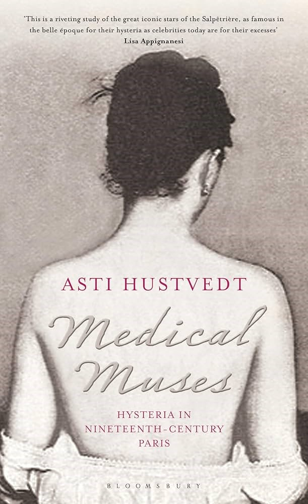

---

title: "Les hystériques de la Salpêtrière au 19e siècle faisaient-elles semblant d’être malades ?"
author: 
    - Mathilde Castanié

tags:
    - histoire/civilisation
    - littérature/linguistique
    - époque contemporaine
    - corps
    - santé
    - partenariat EHNE

abstract: "Dans l’ouvrage Medical Muses. Hysteria in Nineteenth-Century, Asti Hustvedt étudie trois patientes de Charcot – Blanche, Augustine et Geneviève –, hystériques célèbres des années 1870, à La Salpêtrière. Le diagnostic d’hystérique, honteux, est pourtant emblématique de la condition féminine au 19e siècle et de ses empêchements. L’hystérie, à cette période, n’est pas seulement une préoccupation de médecins mais un imaginaire social incarné dans la presse, les photographies, sculptures, peintures, dessins et romans. Les hystériques en constituent les protagonistes : la théâtralité des symptômes est aussi à comprendre comme le seul espace d’expression possible pour la souffrance de ces femmes."
---

## Une histoire de l'hystérie par les patientes

Dans *Medical Muses* (Ill. 1), l’histoire de l’hystérie s’incarne dans des relations asymétriques entre des hommes docteurs, en bonne santé, très éduqués, de la bourgeoisie, et des femmes malades, sans instruction, issues des classes populaires. Jean-Martin Charcot (1825 - 1893), après avoir envisagé une carrière artistique, se forme à la médecine dans un contexte où les médecins sont héroïsés. Il entre à la Salpêtrière en 1852, à 27 ans, avec une appétence prononcée pour l’observation clinique : dans ses « leçons du mardi » qui attirent un public varié les démonstrations de l’hystérie, en particulier sous hypnose, sont théâtralisées. Un médecin peut créer un état cataleptique chez une femme, la percer avec des aiguilles, puis la rendre léthargique, pétrifiée dans des postures improbables et enfin, somnambulique. Les hystériques sont aussi traitées comme des actrices lorsque Charcot les envoie en tournée, comme Blanche Wittman à l’Hôtel-Dieu.

Le modèle hystérique établi par Charcot ne survit pas à sa mort en 1893. Deux ans plus tard, Freud affirme dans ses *Études sur l’hystérie* que celle-ci vient de souvenirs refoulés. Réfléchir à la capacité d’agir des femmes a actualisé une question déjà formulée par les critiques de Charcot : ces femmes étaient-elles véritablement malades ou simulaient-elles leurs troubles ? En entrant dans l’histoire d’une maladie par les patientes, l’ouvrage apporte une réponse originale à cette question. Les symptômes dont souffraient la plupart des hystériques ne sont plus reconnus comme des symptômes psychiatriques aujourd’hui. Cependant, les maladies n’existent pas en dehors des diagnostics : les hystériques de la Salpêtrière vivaient à une époque qui ne leur permettait pas d’exprimer autrement leur souffrance.

Cette approche historique et culturelle des maladies a conduit à comprendre l’hystérie comme une expression de la condition sociale des femmes au 19e siècle. Les symptômes de la maladie (paralysie, surdité, mutisme, sensation d’étranglement) peuvent être, au moins en partie, compris comme une réponse aux attentes sociales pesant sur les femmes. Celles-ci sont souvent sans père, sans mari et sans argent. Une partie d’entre elles ne seraient pas considérées comme malades aujourd’hui ; d’autres seraient diagnostiquées schizophrènes, bipolaires ou souffrant de troubles du comportement alimentaire. Mais elles ne sont pas seulement malades de la misogynie de la société et de la tyrannie de Charcot : l’hystérie, parce qu’elle se situe entre des troubles psychosomatiques et somatiques, crée une confusion entre maladie réelle et imaginaire. Asti Hustvedt démontre que ce diagnostic, bien qu’honteux, leur ouvrait un espace et un moyen d’expression de leur souffrance. La culture de l’hôpital autorisait ces femmes à exposer leur détresse, en dépit du regard libidineux du personnel médical, et d’être actrices de leur célébrité.

## Les hystériques, des muses d’hôpital

L’hystérie est un spectacle à la mode au 19e siècle. Les « leçons du mardi » attirent médecins et étudiants mais aussi des artistes, écrivains, acteurs, hommes politiques et autres curieux, dont Guy de Maupassant, Henri Bergson, le préfet de police Lépine et même l’empereur du Brésil Dom Pedron d’Alcantra. En bref, le Tout-Paris, demi-mondaines comprises. Devant ce public, les femmes hypnotisées doivent performer des scénarios érotiquement chargés. Le Bal des Folles annuel est aussi largement couvert par la presse. Dans les années 1870, les internes Désiré Bourneville et Paul Regnard font paraître plusieurs volumes de photographies qui contribuent à la célébrité de ces hystériques. En 1887, un tableau d’André Brouillet (Ill.2) représente Blanche Wittman en corset, retenue seulement par le docteur Joseph Babinski (1857-1932), comme un couple d’amoureux. Il a durablement modelé l’imaginaire de la Salpêtrière et de son personnel médical.

Blanche Wittman (1859-1913), surnommée la « reine des hystériques », est la malade dont les symptômes correspondent le plus au schéma de Charcot. Elle a une incroyable prédisposition à l’hypnose et répond très bien au dermographisme – pratique d’écriture sur la peau du malade – et à la catalepsie, lorsqu’elle reste figée comme une statue aux yeux grands ouverts. Alors qu’en 1878, l’*Iconographie photographique de la Salpêtrière* rapporte que le nom de l’hôpital est marqué sur sa peau, le psychologue Joseph Delboeuf explique dans la *Revue de Belgique*, en 1886, avoir pu jouer du compresseur d’ovaires sur le corps de Blanche, qui répond automatiquement, comme un piano. Les médecins la piquent avec des épingles pour observer son anesthésie complète. Paul Regnard, étudiant de Charcot, écrit dans *Les maladies épidémiques de l’esprit* (1887) « on peut les couper, les piquer, les brûler, elles ne sentent rien »,  telles des poupées mécaniques dont les zones hystérogéniques répondraient de manière appropriée.

Charcot défend la théâtralité de l’hystérie : l’hystérique est une actrice par nature, ce qui coupe court aux accusations contemporaines de mimer de faux symptômes afin d’attirer l’attention. Elle est aussi une figure des fictions médicales, à l’image des *Morticoles* de Léon Daudet. Au 19e siècle, littérature et médecine se lient si étroitement qu’un gynécologue peut écrire la préface d’un roman, comme Georges Barral dans *Le faiseur d’hommes* d’Yveling Rambaud et Dubut de Laforest en 1884. Alexandre Dumas préface la thèse sur la fécondation artificielle du Dr J. Gérard. Les médecins écrivent avec des romanciers, analysent leurs personnages dans des textes à mi-chemin entre critique littéraire et débat médical. En analysant les hystériques comme muses médicales, Asti Hustvedt s’inscrit dans la porosité documentaire typique du 19e siècle, entre médecine et littérature, science et art. C’est aussi pour cela que la littérature est pensée comme dangereuse pour les femmes lectrices : Blanche Wittman récitait des passages de *Madame Bovary* dans ses délires.

## Document : Augustine, icône du 19e pour le 20e siècle

Les hystériques inspirent nombre d’artistes. Si Blanche Wittman est l'hystérique emblématique du 19e siècle, les poètes Louis Aragon et André Breton font d'Augustine une icône du siècle suivant. En 1928, ils reproduisent six photographies d’Augustine dans *La Révolution Surréaliste* commémorant « le cinquantenaire de l’hystérie (1878-1928) ». Breton a étudié la médecine à partir de 1913, notamment auprès de Joseph Babinski, représenté sur le tableau de Brouillet (Ill. 2). Dans *Nadja* (1962), il rend hommage à ce que le *Manifeste du surréalisme* doit à l’enseignement de Babinski.

« Nous, surréalistes, tenons à célébrer ici le cinquantenaire de l’hystérie, la plus grande découverte poétique de la fin du 19e siècle, et cela au moment même où le démembrement du concept de l’hystérie paraît chose consommée. Nous qui n’aimons rien tant que ces jeunes hystériques, dont le type parfait nous est fourni par l’observation relative à la délicieuse X. L. (Augustine) entrée à la Salpêtrière dans le service du Dr Charcot le 21 octobre 1875, à l’âge de 15 ans ½, comment serions-nous touchés par la laborieuse réfutation de troubles organiques, dont le procès ne sera jamais qu’aux yeux des seuls médecins celui de l’hystérie ? Quelle pitié ! M. Babinski, l’homme le plus intelligent qui se soit attaqué à cette question, osait publier en 1913 : « quand une émotion est sincère, profonde, secoue l’âme humaine, il n’y a plus de place pour l’hystérie ». Et voilà encore ce qu’on nous a donné à apprendre de mieux. Freud, qui doit tant à Charcot, se souvient-il du temps où, au témoignage des survivants, les internes de la Salpêtrière confondaient leur devoir professionnel et leur goût de l’amour, où, à la nuit tombante, les malades les rejoignaient au-dehors ou les recevaient dans leur lit ? Ils énuméraient ensuite patiemment, pour les besoins de la cause médicale qui ne se défend pas, les attitudes passionnelles, soi-disant pathologiques qui leur étaient, et nous sont encore humainement si précieuses. […] Nous proposons donc, en 1928, une définition nouvelle de l’hystérie : l’hystérie est un état mental plus ou moins irréductible se caractérisant par la subversion des rapports qui s’établissent entre le sujet et le monde moral duquel il croit pratiquement relever, en dehors de tout système délirant. Cet état mental est fondé sur le besoin d’une séduction réciproque, qui explique les miracles hâtivement acceptés de la suggestion (ou contre-suggestion) médicale. L’hystérie n’est pas un phénomène pathologique et peut, à tous égards, être considérée comme un moyen suprême d’expression. »
Extrait de Louis Aragon et André Breton, « Le cinquantenaire de l’hystérie », *La Révolution surréaliste*, n°11, mars 1928, p. 20

Augustine est domestique lorsque son maître, qui est aussi celui de sa mère, la viole à l’âge de 13 ans. Elle souffre ensuite de douleurs abdominales, de crampes, de vomissements, puis de ses premières crises d’hystérie. Elle se scarifie, tente de s’enfuir, mais la violence de ses crises l’en empêche. Elle change d’employeur et devient sexuellement active, ce qui fait enrager ses parents. L’intensité de ces disputes révèle un secret de famille : son frère est le fils de son maître, donc de son violeur. Sa mère l’amène à la Salpêtrière en 1875. On peut supposer qu’une jeune fille de 14 ans parle peu de son viol mais lors de ses crises, elle est intarissable à ce sujet. À partir de 1877, le médecin Désiré-Magloire Bourneville, qui ne doute pas de la véracité de ses propos, retranscrit son récit en insistant sur le viol et la culpabilité de la mère. Augustine apparaît en 1878 et 1879 dans l’*Iconographie photographique de la Salpêtrière*. Après plusieurs tentatives, elle parvient à s’enfuir le 9 septembre 1885, déguisée en homme.

Ce filtre surréaliste fait d’Augustine l’icône de la Salpêtrière jusqu’à aujourd’hui, dans les travaux d’Elaine Showalter, Georges Didi-Huberman, Lisa Appignanesi, ou dans la culture populaire avec les films de Jean-Claude Monod et Jean-Christophe Valtat (2003), Zoe Beloff (2005) et Alice Winocour (2012).

## Bibliographie 

APPIGNANESI Lisa, *Mad, Bad and Sad : A history of Women and the Mind Doctors from 1800 to the Present*, Virago, 2009.

DIDI-HUBERMAN Georges, *Invention de l’hystérie : Charcot et l’iconographie photographique de la Salpêtrière*, Macula, 2012.

EDELMAN Nicole, *Les Métamorphoses de l’hystérique. Du début du XIXe siècle à la Grande Guerre*, La Découverte, 2003.

SHOWALTER Elaine, *The female malady : women, madness, and English culture, 1830-1980*, Penguin Books, 1987.

## Filmographie 

BELOFF Zoe, *Charming Augustine*, 40 mm, 2005.

MONOD Jean-Claude et VALTAT Jean-Christophe, *Augustine*, 43 mm, 2003.

WINOCOUR Alice, *Augustine*, 102 mm, 2012.
