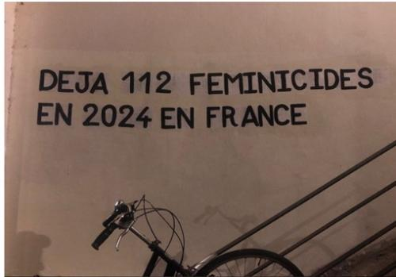

Les prises de parole conduisent à la définition du féminicide comme un crime systémique et politique, car il repose sur la terrorisation des femmes et résulte de dynamiques de pouvoir. Après l’attentat antiféministe de l’école Polytechnique de Montréal (1989), Diana Russell et Jill Radford rassemblent en 1992 ces réflexions dans l’ouvrage *Femicide: The Politics of Woman Killing*. Le féminicide y est défini comme « le meurtre de femmes parce qu’elles sont des femmes » et inscrit dans le continuum des violences de genre et des violences sexuelles.

## Généalogies féministes du féminicide

La politiste et socio-historienne Margot Giacinti retrace, dans son ouvrage *Le Commun des mortelles. Faire face au féminicide* (Ill. 1), l’histoire d’une idée politique, le féminicide. La principale originalité de l’ouvrage est de remonter à la Révolution française, alors que c’est seulement dans les années 1970 que le féminicide est théorisé comme « le meurtre d’une femme parce qu’elle est une femme », et donc comme un problème politique et social structurel. Elle écrit ainsi la généalogie d’une « non-idée ». Elle s’intéresse autant aux paradigmes qui ont longtemps contribué à invisibiliser le féminicide – depuis le paradigme conjugaliste, qui le réduisait à un meurtre entre époux, jusqu’au paradigme du crime passionnel, qui en ferait la conséquence d’un amour trop intense – qu’aux différentes étapes qui scandent son émergence progressive dans les luttes féministes. 

Parallèlement à cette genèse intellectuelle, l’installation progressive du féminicide comme concept central des luttes féministes (Ill. 3) a également emprunté d’autres voies. Le travail des associations féministes envers les « femmes battues », comme SOS Femmes alternatives (fondé en 1975), qui luttent sur le terrain contre les féminicides sous leur forme conjugale, a contribué à cette prise de conscience. Margot Giacinti insiste aussi sur les appropriations du concept chez les féministes d’Amérique centrale, comme Montserrat Sagot, Ana Carcedo ou Marcela Lagarde. Leurs enquêtes et écrits, indissociables de luttes comme le mouvement argentin Ni Una Menos (« Pas une de moins »), ont contribué à diffuser le concept et à en élargir le périmètre au-delà du cadre conjugal, en intégrant notamment le milieu du narcotrafic (comme à Ciudad Juárez) ou la violence communautaire.

Le terme de féminicide apparaît dès la fin du xixe siècle, et Margot Giacinti analyse finement les glissements dans les usages qui en sont faits. Sous la plume de la militante féministe et suffragiste Hubertine Auclert (1848-1914), le terme sert moins à dénoncer le meurtre d’une femme parce qu’elle est femme qu’à condamner les inégalités et les violences contre les femmes, et à réclamer l’intervention de l’État. Dans la rubrique « Féminisme » du journal *Le Radical*, elle utilise le terme à plusieurs reprises : en 1897, pour dénoncer le privilège de l’utilisation du forceps, qui met en danger la vie des personnes qui accouchent, par les médecins (et non les sage-femmes) ; en 1902, pour dénoncer l’exploitation des femmes dans le mariage puis, parfois, dans le divorce.

La journaliste n’est alors pas la seule à s’inquiéter des violences contre les femmes. Plusieurs générations de féministes problématisent cet enjeu entre la fin du xixe siècle et le premier xxe siècle. En France, leurs luttes cristallisent autour de la revendication de suppression de l’article 324 du Code Pénal de 1810 (supprimé en 1975), qui excuse le meurtre d’une épouse par son époux en cas de flagrant délit d’adultère dans la maison conjugale. C’est par exemple l’une des revendications du Congrès du droit des femmes d’août 1878. La militante Eugénie Potonié-Pierre (1844-1898) envoie en 1895 une pétition à la Chambre des députés pour renouveler la demande de suppression de cet article et exiger la participation des femmes aux jurys d’assises. En Grande-Bretagne également, les féministes participent, comme Frances Power Cobbe (1822-1904) en 1878, à la dénonciation des « tortures conjugales ». Quant à Florence Fenwick Miller (1854-1935), elle souligne la banalité des meurtres de Jack l’Éventreur (1888) qui comme tant d’autres ciblent des femmes, et dénonce les mécanismes légaux qui rendent de tels meurtres possibles en assurant l’impunité des hommes violents. 

## Problème structurel et résistances féminines

Si donc les féministes cherchent à lutter contre les violences contre les femmes, c’est dans les années 1970 que le féminicide est théorisé comme violence de genre. La sociologue et militante sud-africaine Diana Russell, liée aux mouvements féministes européens, joue en la matière un rôle de premier plan. Elle est l’une des chevilles ouvrières de l’organisation du Tribunal international des crimes contre les femmes, qui se tient en mars 1976 à Bruxelles (Ill. 2). En plaçant au centre de la procédure l’écoute des témoignages des victimes, ce tribunal collectif vise à faire entendre les expériences des crimes contre les femmes, qu’il s’agisse de violences sexualisées, de violences reproductives, médicales ou de violences politiques (comme la torture ou l’emprisonnement). Des délégations de femmes de différents pays, principalement d’Europe et des États-Unis, sont présentes et témoignent. La poétesse afro-américaine et lesbienne Pat Parker intervient par un poème au sujet du féminicide de sa sœur, qui n’a pas été reconnu comme meurtre (« Womanslaughter », 1978). Les militantes états-uniennes Phyllis Lyon et Del Martin, à partir des théorisations de la féministe Carol Orlock, proposent au Tribunal un état des lieux du traitement des féminicides aux États-Unis à partir de leur couverture médiatique. 

Les prises de parole conduisent à la définition du féminicide comme un crime systémique et politique, car il repose sur la terrorisation des femmes et résulte de dynamiques de pouvoir. Après l’attentat antiféministe de l’école Polytechnique de Montréal (1989), Diana Russell et Jill Radford rassemblent en 1992 ces réflexions dans l’ouvrage *Femicide: The Politics of Woman Killing*. Le féminicide y est défini comme « le meurtre de femmes parce qu’elles sont des femmes » et inscrit dans le continuum des violences de genre et des violences sexuelles.

Parallèlement à cette genèse intellectuelle, l’installation progressive du féminicide comme concept central des luttes féministes (Ill. 3) a également emprunté d’autres voies. Le travail des associations féministes envers les « femmes battues », comme SOS Femmes alternatives (fondé en 1975), qui luttent sur le terrain contre les féminicides sous leur forme conjugale, a contribué à cette prise de conscience. Margot Giacinti insiste aussi sur les appropriations du concept chez les féministes d’Amérique centrale, comme Montserrat Sagot, Ana Carcedo ou Marcela Lagarde. Leurs enquêtes et écrits, indissociables de luttes comme le mouvement argentin Ni Una Menos (« Pas une de moins »), ont contribué à diffuser le concept et à en élargir le périmètre au-delà du cadre conjugal, en intégrant notamment le milieu du narcotrafic (comme à Ciudad Juárez) ou la violence communautaire.

## Problème structurel et résistances féminines

Ce livre se fonde également sur des archives judiciaires. À partir de cinq procédures dans le département du Rhône, entre la Révolution et les années 1950, Margot Giacinti décortique les caractéristiques récurrentes qui contribuent à faire du féminicide un problème structurel. Quand bien même ces procédures concernent différents types de féminicides (conjugaux comme crapuleux) et différentes classes sociales, un « script » commun s’en dégage.

Tout d’abord, le meurtre est rarement la première violence masculine. Il s’inscrit dans des pratiques d’exploitation et dans un continuum de violences psychologiques, physiques ou sexuelles contre les femmes et les enfants. Ensuite, le féminicide est souvent préparé, c’est-à-dire prémédité et annoncé par le biais de menaces. Les gestes de la violence féminicidaire sont caractérisés par l’excès, le « surmeurtre » (overkilling) : il ne s’agit pas seulement de tuer, mais de souiller, d’abîmer, de détruire. La dernière caractéristique récurrente tient au traitement policier et pénal de ces crimes : malgré l’évolution des sanctions et peines, la dimension sexo-spécifique du crime n’est jamais prise en compte, et la suspicion est souvent retournée vers le comportement et le passé des femmes, soupçonnées d’être de « mauvaises victimes ».

À travers les parcours de femmes victimes de féminicides, l’ouvrage donne enfin à voir et à entendre les résistances individuelles et collectives. Les femmes ne sont pas passives face aux féminicides. Elles parlent : elles dénoncent les violences auprès de leur entourage, souvent d’autres femmes, qui témoignent ensuite lors des procès, et saisissent parfois les autorités policières ou judiciaires. Elles peuvent également tenter de se séparer ou de divorcer d’un conjoint violent. Au début du xxe siècle, l’ouvrière chenilleuse lyonnaise Francine Senèze évoque avec différentes personnes de son entourage les violences physiques et les pressions sexuelles de son mari, déjà condamné pour avoir vitriolé sa précédente compagne. Face à cette situation qu’elle juge insupportable, elle quitte le domicile conjugal et demande le divorce en 1908, en explicitant à l’institution judiciaire et à son mari les causes de son départ. Elle sollicite aussi le soutien financier de son amie Marie Feuillastre. Cette dernière est d’ailleurs présente lorsque le mari de Francine Senèze la poursuit, armé, dans la rue, et elle cherche à la protéger de l’attaque conjugale à laquelle elle succombe.

##Bibliographie

Pavard Bibia, Rochefort Florence, Zancarini-Fournel Michelle, *Ne nous libérez pas, on s’en charge : une histoire des féminismes de 1789 à nos jours*, Paris, La Découverte, 2020. 

Delage Pauline, *Violences conjugales. Du combat féministe à la cause publique*, Paris, Presses de Sciences Po, 2017.

Giacinti Margot, *« Quand il n’y a pas mort d’hommes ». Socio-histoire du féminicide en France (1791-1976)*, thèse en science politique, ENS de Lyon, 2023.

Vanneau Victoria, *La Paix des ménages : histoire des violences conjugales, xixe-xxe siècle*, Paris, Anamosa, 2016.

