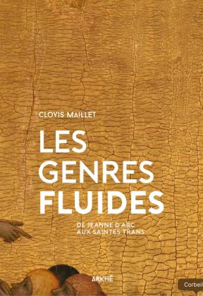

#abstract: "Dans son ouvrage *Les genres fluides. De Jeanne d’Arc aux saintes trans* (Paris, Arkhê, 2020), Clovis Maillet affirme qu’il existait déjà des personnes transgenres au Moyen Âge. Les cas de transidentité qu’il étudie permettent de mieux comprendre comment le Moyen Âge conceptualisait le genre."
---

## Clovis Maillet, *Les genres fluides*

On trouve dans les sources médiévales plusieurs cas de personnes nées femmes qui passent leur vie habillées en homme – et quelques cas, beaucoup plus rares, de personnes, nées hommes, qui vivent sous une identité féminine. Comment les qualifier ? Des travaux anciens parlaient volontiers de « travestissement », voire de « déguisement », quand ils ne présentaient pas tout simplement ces cas comme de pures affabulations légendaires.

Clovis Maillet montre que l’on peut pourtant bel et bien parler de transidentité (Ill. 1). Dans plusieurs des cas qu’il étudie, des personnes assignées femmes à la naissance ont été considérées par leurs contemporains comme des hommes. Ce n’est donc pas un anachronisme que de considérer ces personnes comme « transgenres » : au contraire, cela nous permet de saisir la manière dont fonctionne le système de genre au Moyen Âge.

Pour parvenir à saisir les personnes transgenres médiévales, l’auteur mobilise une variété de sources, tant écrites qu’iconographiques. L’hagiographie (le récit de la vie des saintes et des saints) constitue un matériau privilégié : c’est dans ces textes que l’on trouve, depuis l’Antiquité, le plus de mentions de transidentités. Mais les romans peuvent aussi en faire mention. Tous ces textes sont, à l’occasion, mis en image, tant dans les manuscrits que sur les chapiteaux des églises (Ill. 2). C’est ce croisement qui permet de restituer au mieux les expériences transgenres du passé, dans une approche qui ne se limite pas aux strictes sources écrites.

Ces sources étudiées par Clovis Maillet font ressortir la fluidité des assignations de genre au Moyen Âge : les mêmes personnes y sont en effet désignées tantôt au féminin, tantôt au masculin, en fonction du moment du récit, mais aussi des auteurs, de leurs préoccupations comme du contexte de rédaction. Ces récits permettent de faire ressortir deux éléments constitutifs de la transidentité : en changeant de genre, les personnes changent souvent de nom et de vêtements. Ainsi, Silence, le héros éponyme du roman qui lui est consacré au xiiie siècle, est né fille mais son père, qui désire un héritier, décide d’en faire un homme : il lui fait donc changer de vêtements et lui attribue un nom épicène (à la fois masculin et féminin).

Dans d’autres cas, ce qui permet à une personne née femme d’être reconnue comme un homme, c’est son renoncement à la sexualité et à la chair. Dans les pensées antiques et médiévales en effet, les femmes sont du côté du charnel, tandis que les hommes sont considérés comme plus aptes à dominer leur corps. Une femme qui contrôle ses pulsions ou mène des actions courageuses, quel que soit le domaine, agit donc, selon les textes médiévaux, virilement (viriliter en latin) : elle dépasse – et c’est valorisé – les limites de son sexe. Une femme médiévale peut donc être considérée socialement comme un homme grâce à la maîtrise de son corps. C’est notamment le cas des jeunes personnes, nées femmes, qui désirent entrer au monastère et vivre une vie de privation et d’ascèse (Ill. 2). En 1188, au monastère de Schönau, meurt un certain moine Joseph : pendant sa toilette mortuaire, les autres moines découvrent, stupéfaits, qu’il a un corps de femme. Des cinq textes médiévaux consacrés à ce moine, seul le plus tardif fait de Joseph – alors appelé Hildegonde – une jeune fille ; pour les quatre autres, peu importe son sexe de naissance, Joseph a bien acquis le droit de se dire homme.

## Bibliographie 

Jablonski-Sideris Georges, « Pour une approche Queer de l’enseignement historique dans l’éducation aux genres, sexualités et dans l’éducation à la santé », *Recherches & éducations*, n°19, 2018.

Lafleur Greta, Raskolnikov Masha, Klosowska Anna (ed.), *Trans Historical. Gender Plurality before the Modern*, Ithaca, Londres, Cornell University Press, 2021.

Spencer-Hall Alicia, Gutt Blake (ed.), *Trans and Genderqueer Subjects in Medieval Hagiography*, Amsterdam, Amsterdam University Press, 2021.

Steinberg Sylvie, *La confusion des sexes. Le travestissement de la Renaissance à la Révolution*, Paris, Fayard, 2001.

Villemur Frédérique, « Saintes et travesties du Moyen Âge », *Clio. Femmes, Genre, Histoire*, n°10, 1999.

