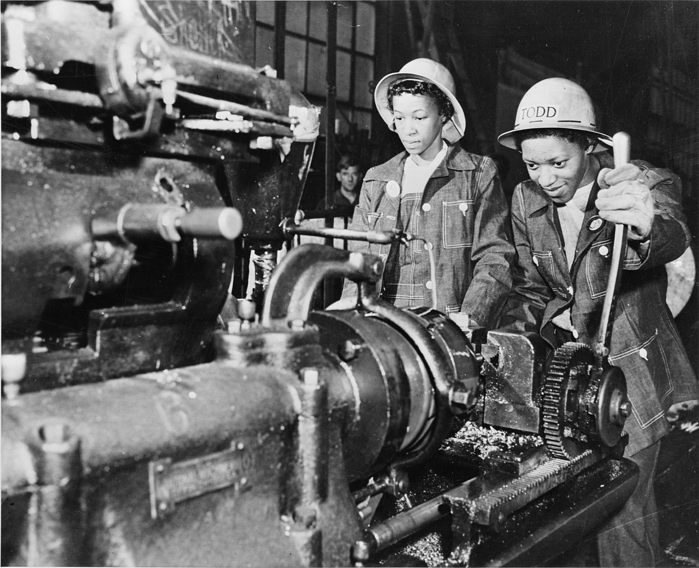

## Définition

L’intersectionnalité (de l'anglais intersectionality) ou intersectionnalisme est une notion employée en sociologie et en réflexion politique, qui désigne la situation de personnes subissant simultanément plusieurs formes de stratification, domination ou de discrimination dans une société. Ainsi, dans l'exemple d'une personne appartenant à une minorité ethnique et issue d'un milieu pauvre, celle-ci pourra être à la fois victime de racisme et de mépris de classe.

Le terme a été proposé par l'universitaire afroféministe américaine Kimberlé Williams Crenshaw en 19891 pour parler spécifiquement de l'intersection entre le sexisme et le racisme subis par les femmes afro-américaines, pour en évaluer les conséquences en matière de pouvoir, et expliquer pourquoi ces femmes n'étaient pas prises en compte dans les discours féministes de l'époque2. Le sens du terme a depuis été élargi, dans les années 2010, avec la montée du cybermilitantisme et englobe désormais toutes les formes de discriminations qui peuvent s'entrecroiser.

Cette notion est une importante contribution théorique des études sur le féminisme. Pour ses partisans, elle permet aux modèles de réflexion d'aborder la complexité du monde tout en maintenant l'élan politique qui porte la plupart des actrices et acteurs de ce milieu. 

## Histoire de la notion

Awa Thiam est la première féministe à formuler en 1978 dans son essai La Parole aux négresses la question du positionnement des femmes noires francophones dans le mouvement féministe, produisant une première base théorique de l'intersectionnalité bien qu'elle n'applique pas à cette notion le terme d'intersectionnalité12.

Awa Thiam explique que les femmes noires souffrent de plusieurs oppressions simultanément et les problèmes spécifiques qu'elles rencontrent ne sont pas traités au sein du mouvement féministe blanc et occidental13.

Le terme intersectionality a été inventé par l'universitaire féministe afro-américaine Kimberlé Williams Crenshaw dans une enquête publiée en 1991 et portant sur les violences subies par les femmes de couleur dans les classes défavorisées aux États-Unis14,15. Celle-ci avait entamé sa réflexion sur les intersections entre discriminations dans un article de 1989 dont la réflexion se situait dans la lignée du courant du black feminism16. Ce terme a été repris depuis par de nombreuses autres études, bien que d'autres termes, comme « interconnectivité » ou « identités multiplicatives », aient également été utilisés pour qualifier la même démarche17.

Cette théorie a remporté un grand succès dans le contexte des études de genre15. Elle aborde un problème difficile pour le féminisme : les différences entre femmes. Le vieil idéal d'un féminisme où toutes les femmes seraient ensemble est difficile à tenir18,19, et cette théorie apporte une plate-forme qui peut être commune à tous les courants. Elle rend visibles les différences de race, genre et classe tout en déconstruisant ces catégories. Dans un cadre universitaire, elle donne à réfléchir à la fois aux généralistes et aux spécialistes, tout en établissant une passerelle entre les deux ; dans ce cadre, l'intersectionnalité forme un mot tendance, capable d'attirer l'attention s'il est présent dans le titre d'un article scientifique. Enfin, son incomplétude même rend cette théorie attirante, et donne à chacun la possibilité de la compléter ; elle ouvre à de nouvelles discussions et à de nouvelles découvertes. Cette théorie, qui met en lumière la complexité du monde, donne aux sociologues et aux féministes les moyens de l'aborder2. Par exemple, la notion aide à comprendre en quoi les femmes noires ou pauvres ne subissent pas les mêmes violences ou discriminations que les femmes issues des classes socio-professionnelles favorisées et blanches. 

## Url associé.e

https://fr.wikipedia.org/wiki/Intersectionnalit%C3%A9
