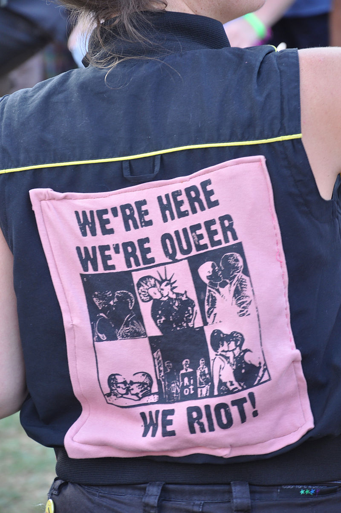
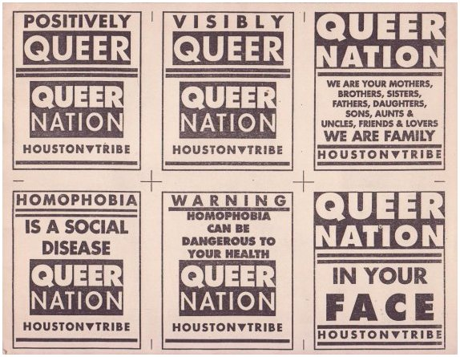

## Histoire

### En anglais

Le mot anglais queer est utilisé jusqu'à la fin du XIXe siècle dans les pays anglophones pour signifier ce qui est bizarre, étrange, malade ou anormal1. Ce sens, toujours utilisé, s'étend, à partir de la fin du XIXe siècle pour désigner péjorativement les minorités sexuelles et de genre, c'est-à-dire les personnes qui dévient de la norme sexuelle (queer comme « déviant »)1. Rapidement, le terme est récupéré par ces mêmes minorités pour se désigner elles-mêmes, en particulier les hommes homosexuels, qui y voient non pas une connotation négative mais au contraire neutre (queer comme « différent ») ou positive (queer comme « spécial »)1.

Dans les années 1920 et 1930, queer prend un nouveau sens, une partie des hommes homosexuels anglophones utilisant ce terme pour se différencier des homosexuels efféminés, les « fairies » : dans ce sens, queer signifie l'homosexuel respectable, c'est-à-dire de classe moyenne et d'apparence discrète1.

Après la seconde guerre mondiale, toujours dans le monde anglophone, le terme queer tombe en désuétude dans son sens d'autonomination par les minorités sexuelles. Il n'est plus employé, dans les années 1960 et 1970, que par les homosexuels les plus âgés, les plus jeunes lui préférant le terme « gay »1. Cette préférence est elle-aussi motivée par une distanciation, cette fois double : par rapport aux fairies, mais aussi par rapport à la génération précédente1. 

Le terme queer prend une nouvelle dimension en 1990 et l'apparition du groupe Queer Nation (en) dont les actions visent à améliorer la visibilité des minorités sexuelles et de genre et de lutter contre l'homophobie1. L'utilisation du terme queer est alors une stratégie politique assumée, celle de se désigner par l'insulte (queer comme « nous que vous nommez déviants ») et ainsi de refuser de cacher son identité en échange d'une forme de respectabilité2.

Ce groupe redonne à la fois une nouvelle jeunesse à l'utilisation de queer comme terme d'autonomination, mais lui apporte de nouvelles connotations : d'une part, en raison de l'approche intersectionnelle de Queer Nation, queer se retrouve associé aux luttes politiques radicales, à la lutte contre le sexisme et à l'antiracisme ; d'autres part, queer se retrouve utilisé comme contrepoint révolutionnaire, aux identités « gay » et « lesbienne », qui se retrouvent alors colorées, pour une partie des minorités sexuelles, de connotations excluantes et figées associées aux classes moyennes blanches1. Dans cette perspective, queer est pensé comme à la fois plus inclusif de la multiplicité des minorités de genre, notamment les personnes bisexuelles, trans, mais aussi lesbiennes butch, lesbiennes fem, et hommes gays efféminés, mais surtout comme une perspective radicale visant à la destruction des normes sexuelles, culturelles et sociales oppressives plutôt que leur aménagement1.

Pour la professeure d'études de genre et de littérature Heather Love, la réutilisation du terme queer, c'est-à-dire la récupération d'une insulte, permet de souligner l'importance de la violence et de la stigmatisation dans l'expérience des minorités sexuelles et de genre3.

Au tournant du XXIe siècle, le terme queer rentre dans le vocabulaire mainstream, ce dont témoignent l'arrivée en 1999 de la série Queer as Folk et de l'émission de téléréalité Queer Eye for the Straight Guy en 2003 : le journaliste Yusuf Tamanna note que pour ces exemples l'utilisation du terme queer dans un contexte grand public signifie en réalité homosexualité blanche de classes supérieures2.

Malgré ces évolutions et enrichissements multiples de sens pendant près d'un siècle, le sens péjoratif de queer demeure encore dans les années 2010 et 2020, au point qu'il soit évité par une partie de la communauté LBGT+, en particulier la plus âgée, en raison d'un véritable traumatisme associé à ce mot.

### En français

Le mot « queer » apparaît en français par transfert linguistique à la fin du XXe siècle, dans son double sens de désignation large des minorités sexuelles et de genre et de terme aux connotations politiques6. Par opposition à ce terme ou par souhait de le traduire, l'expression « transpédégouine » est aussi utilisée7,8. 

## Périmètre

### Comme synonyme de la diversité sexuelle et de genre

Le terme « queer » est employé depuis les années 1990 pour désigner l'ensemble de la diversité sexuelle et de genre, et en particulier les personnes lesbiennes, gays, bisexuelles, transgenres, intersexes et asexuelles (LGBTIA)9. Pour le professeur de sociologie Chacha Enriquez, « l’idée, c’est de sortir du mouvement uniquement gay et lesbien pour former une coalition des groupes et personnes marginalisés et opprimés sur l’axe sexe-genre-sexualité »9. 

### Comme existence en dehors de normes

#### Normes de genre

Le terme « genderqueer », ou « de genre queer » au Québec, peut à la fois être un synonyme de non-binaire, mais aussi avoir un sens plus restreint et désigner une identité non-binaire particulière basée sur la remise en cause des normes sociales10.

La mode queer est la mode propre aux personnes queer et non-binaires allant au-delà des normes de style courantes qui associent généralement certaines couleurs et formes à l'un des deux genres binaires. La mode queer vise à être perçue par les consommateurs comme un style de mode promouvant le choix de vêtements en fonction des différentes formes corporelles des personnes plutôt qu'en fonction des normes vestimentaires déterminées par le genre. 

#### Normes relationnelles

Une relation platonique queer est une forme de relation intime (en) qui, bien qu'elle ne soit pas de nature romantique, implique toutefois une forme d'engagement. Cet engagement les éloigne ainsi de l'amitié pour les rapprocher des relations amoureuses. Pour Julie Sondra Decker (en), ce qui définit l'attraction queerplatonique est sa position ambiguë par rapport aux catégories normatives : « c'est une relation platonique, mais elle est queer d'une certaine manière - pas des amis, pas des partenaires romantiques, mais autre chose » 11.

L'anarchie relationnelle est la pratique ou la conviction que les relations ne doivent pas être liées par des règles autres que celles sur lesquelles les personnes impliquées se sont mises d'accord. Si une personne anarchiste relationnelle a de multiples partenaires intimes, cela peut être considéré comme une forme de polyamour, mais le concept d'anarchie relationnelle se distingue du polyamour en postulant qu'il n'est pas nécessaire de faire de distinction formelle entre relations sexuelles, romantiques, intimes, ou platoniques. Ce mode relationnel est souvent pensé comme queer, en particulier comme mise en pratique de l'anarchisme queer, par remise en cause de la norme monogame.

## Url associé.e

https://fr.wikipedia.org/wiki/Queer 

