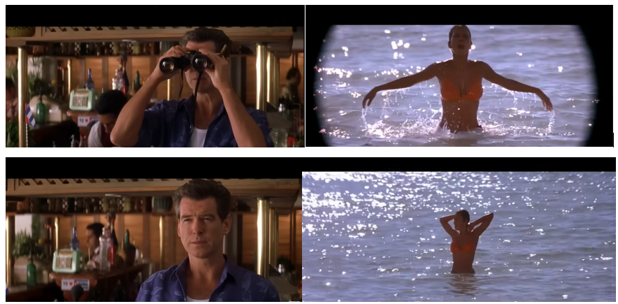
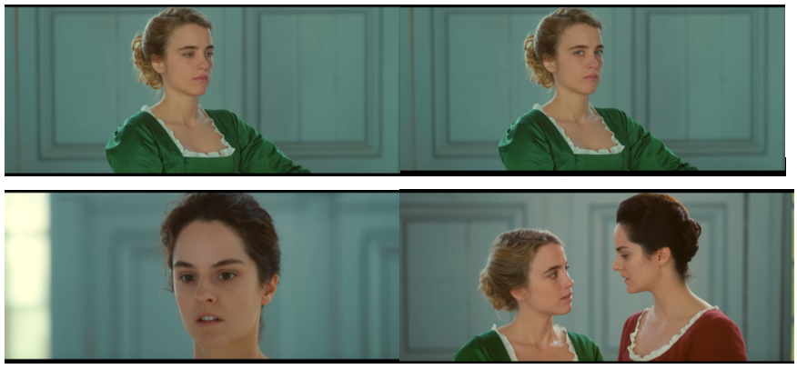

Toutes les œuvres d'art, qu’elles soient cinématographiques, picturales, musicales ou poétiques, témoignent d’un regard sur le monde. C’est pour la singularité de ce regard que les artistes sont appréciés. Mais celui-ci n'est jamais neutre ; il ne peut s'extraire du cadre socioculturel dans lequel l’artiste évolue. Ainsi, dans une société patriarcale, dans laquelle les créations culturelles sont largement écrites, réalisées ou rendues publiques par des hommes, un point de vue majoritaire se dessine en filigrane, présenté comme neutre ou universel, mais derrière lequel se cache un point de vue bien masculin, conceptualisé en anglais sous le terme de « male gaze ». Le patriarcat ne reste pas à la porte de la création artistique, il s’y invite, de manière plus ou moins consciente, plus ou moins frappante.

Pour Azélie Fayolle, chercheuse féministe, « parler de “regard” souligne la continuité entre le regard épistémologique et celui de la “focalisation” (en photographie ou en narratologie) ou du “point de vue” » (*Des femmes et du style: Pour un « feminist gaze »*, p. 33). En d’autres termes, il y a un lien entre la façon dont les artistes comprennent le monde (leur créativité, mais aussi leur cadre socio-culturel, leurs préjugés, leur histoire personnelle…) et la façon dont ces artistes le représentent dans leurs œuvres. Ce point de vue diffère en fonction de notre trajectoire et de nos positions sociales, notre classe sociale, couleur de peau, religion, identité de genre ou orientation sexuelle etc. Un aspect de ce « regard » a particulièrement retenu l’attention des chercheurs et chercheuses en études féministes : la façon dont les artistes regardent et représentent les corps et les rapports de genre.

## Vous avez dit *male gaze* ?

C’est le terme de *gaze* qui revient le plus souvent pour faire référence à ces réflexions sur le point de vue genré. Cela pose deux questions : comment le traduire en français, et pourquoi ne le traduit-on pas toujours? Tout d’abord, on doit la première théorie sur ce sujet à la critique britannique Laura Mulvey, à l’origine de l’expression de « male gaze », non pas comme un simple regard masculin, mais comme une façon de représenter le réel au cinéma. Malgré la large diffusion de sa théorie, elle n’a pas été traduite en français avant les années 2010, soit près de quarante ans après sa publication. Entre l’aura de ce texte et sa diffusion internationale, les chercheurs et chercheuses n’ont pas attendu d’avoir une traduction pour utiliser le concept, qu’ils ont gardé en anglais. L’usage de l’anglais permettait ainsi de désigner à la fois un regard et un geste d’interprétation et de représentation artistique.  

De plus, le terme *gaze* peut se traduire directement par « regard » en français. Il s’applique particulièrement bien au contexte du cinéma dans lequel la théorie a fait surface, ainsi qu’aux arts visuels, mais le terme de « point de vue » exprimerait sans doute mieux le concept dans sa globalité, notamment lorsqu’il s’agit de littérature. 

Enfin, on peut considérer qu’afin de matérialiser la parenté entre les différentes théories sur le regard genré, il était important de garder la même expression, d’où notre triptyque *male gaze*,*female gaze* et *feminist gaze*. 

## Objectif : Comprendre ce qu’est le « regard genré » à travers trois essais critiques majeurs

Cette notice se propose d’expliquer le regard genré en revenant sur trois concepts clés : le *male gaze*, le *female gaze* et le *feminist gaze*. Pour cela, il convient de dresser la généalogie de ces concepts, en revenant sur les trois essais majeurs qui ont posé les bases de ces réflexions et marqué les études féministes en France et sur la scène internationale.

●	Laura Mulvey & le *Male gaze*
Le premier essai, « Visual Pleasure and Narrative Cinema », de Laura Mulvey, est considéré comme le texte fondamental dans la conceptualisation du regard genré, car elle a été la première à parler d’un « regard masculin » (*« male gaze »*). Elle explique comment le regard de la caméra n’est pas neutre, mais il est guidé par le regard du réalisateur, un regard pensé par les hommes et pour les hommes, qui s’accompagne de l’objectification (consciente ou non) des femmes à l’écran. 

●	Iris Brey & le *Female gaze*
Le second essai, *Le regard Féminin, une révolution à l’écran* (2020), écrit par la chercheuse française Iris Brey, propose de renverser la perspective de Mulvey tout en s’inscrivant dans sa continuité et de considérer un regard féminin, qui serait l’expression d’une expérience féminine à l’écran. 

●	Azélie Fayolle & le *Feminist gaze*
Enfin, dans *Des Femmes et du style, pour un feminist gaze* publié en 2023, la chercheuse Azélie Fayolle applique les théories précédentes à la littérature et va plus loin : elle s’attache à démontrer l’existence de styles féministes, ou d’un point de vue féministe, dans la littérature produite par des femmes.

## Laura Mulvey & le *Male gaze*  : filmer les femmes comme objets de désir

Laura Mulvey est une critique de film et cinéaste britannique née en 1941. Son approche est très largement inspirée par la psychanalyse, en particulier par les théories de Freud et Lacan. Dans son article de 1975 « Plaisir visuel et cinéma narratif » (« *Visual Pleasure and Narrative Cinema* »), elle est la première à théoriser le « *male gaze* », « regard masculin », qu’elle voit comme la preuve d’une forme de « phallocentrisme » dans le cinéma. Concept initialement freudien, le phallocentrisme est aujourd’hui entendu comme l’idée selon laquelle la société est construite autour des besoins et pulsions masculines. Mulvey avance que les films sont la projection d'un fantasme masculin à l’écran, inextricablement lié à une forme de dichotomie genrée du plaisir hétérosexuel : d’un côté les sujets désirant actifs (le plus souvent des hommes), et de l’autre des objets désirés et passifs (généralement des femmes) :

"Dans un monde construit sur l’inégalité sexuelle, le plaisir de regarder a été divisé entre l’actif/masculin et le passif/féminin. Le regard déterminant du masculin projette ses fantasmes sur la figure féminine, la modelant en conséquence. Dans leurs rôles traditionnellement exhibitionnistes, les femmes sont à la fois regardées et exposées, leur apparence étant construite pour provoquer un fort impact visuel et érotique qui en soi est un appel au regard [to-be-look-at-ness]. La femme exposée comme objet sexuel est ainsi le motif récurrent du spectacle érotique" (traduction de Gabrielle Hardy).

Le cinéma, à l’image du reste de la société, est caractérisé par les inégalités de genre. Il repose sur et reproduit une forme d’esthétique de l’objectification des femmes à l'écran, représentées par et pour le désir masculin.

Autrement dit, le cadrage d'un film est le résultat d'une prise de vue faite par et pour les hommes, motivée par leur plaisir de voir des corps féminins. Mulvey s’appuie ainsi sur la théorie freudienne de la pulsion scopique : un plaisir de voir et d'observer (généralement sans être vu). L’image filmique est donc la convergence d’un triple point de vue masculin qui s’impose à l’ensemble des spectateur‧ices : 
-	celui du personnage principal qui agit et regarde (et désire) les personnages féminins,
-	 celui du réalisateur qui filme – et regarde – le corps d'une actrice,
-	celui du spectateur, toujours pensé avant tout comme un homme. 

Le spectateur, ou la spectatrice, n’a pas d’autre choix que de partager le regard que la caméra lui impose, et donc d’objectifier à son tour le corps des femmes filmés à l’écran. Ce concept ne s’applique pas uniquement aux scènes érotiques, mais se décline tout au long du film dans les scènes où les personnages féminin apparaissent.

[Une scène de *Meurs un autre jour*](https://www.youtube.com/watch?v=gdbIINpktOs), de Lee Tamahori, sorti en 2002, est souvent citée comme l’exemple canonique de cette superposition de regards. La caméra nous montre James Bond (Pierce Brosnan) observer quelque chose avec des jumelles (A). Le plan suivant est le point de vue de James Bond, marqué par la forme arrondie des jumelles qui observe une jeune femme (Halle Berry) sortir de l’eau (B). Le plan suivant cadre à nouveau James Bond, qui baisse ses jumelles mais continue à regarder la « James Bond Girl » (plan C). Le contre-champ nous montre à nouveau la jeune femme, mais cette fois sans le filtre des jumelles (plan D). La vision du personnage masculin devient la nôtre. 

De ce phénomène découle une autre conséquence dans la représentation des femmes à l'écran: leur rôle restreint dans l'intrigue et leur relatif silence. « La présence de la femme est donc un élément indispensable du spectacle dans les films narratifs classiques, et pourtant son impact visuel tend à empêcher le bon déroulement de l’histoire, à geler l’action en moments de contemplations érotiques » écrit aussi Mulvey (1975, 11). Les personnages féminins sont souvent réduits au silence, ou à des conversations sur les autres personnages masculins et leurs relations. 

C'est ce que dénonce avec brio le test de Bechdel, conceptualisé par la dessinatrice Alison Bechdel dans sa bande-dessinée *La Règle* (*The Rule*). Un de ses personnages explique qu’elle regarde uniquement les films qui remplissent les trois critères suivants :
-	la présence d’au moins deux femmes dont on connaît le nom et le prénom ; 
-	elles doivent discuter ensemble ;
-	leur conversation doit porter sur autre chose qu’un homme. 
Un test que beaucoup de films ont du mal à réussir !

Le cinéma semble être un milieu dominé par les hommes, jusque dans sa manière canonique de filmer les femmes et de scénariser leurs relations entre elles et avec les hommes. Cependant, le point de vue masculin n'est pas (ou plus) le seul à s'imposer dans les films et le point de vue féminin a été également théorisé.

## Iris Brey et le « Regard féminin » : filmer les femmes comme sujets de désir

En réponse à la théorie de Mulvey, la journaliste et critique française Iris Brey publie en 2020 un essai intitulé *Le Regard féminin, une révolution à l'écran*. Elle propose de concevoir un autre regard au cinéma, qui s’opposerait au regard masculin et qu’elle appelle « *female gaze* ». Brey affirme : « Le *female gaze* est un geste conscient. Il produit de ce fait des images conscientisées, politisées. Le regard féminin n’est pas le fruit du hasard, c’est une manière de penser » (p. 18). Contrairement à la théorie de Mulvey, basée sur la psychanalyse, la théorie de Brey tient plutôt d’une « approche phénoménologique et féministe » du regard féminin (p. 40). Là où Mulvey expliquait la part d’inconscient qui motive le cadrage sexiste de certains films, Brey revendique une pratique cinématographique consciente de ses biais et désireuse de montrer autre chose que des personnages féminins effacés, passifs et des images objectifiantes des corps.

Selon elle, ce « *female gaze* » n’est pas l'exact inverse du *male gaze*, qui objectifierait à son tour les corps masculins projetés à l'écran. Il s'agit plutôt d'un point de vue féminin sur le réel, qui ferait ressentir aux spectateur‧ices une expérience vécue par un personnage féminin. Plus qu’une question d’objectification, il s’agit bien d’exprimer un point de vue féminin – un point de vue minoritaire – sur le monde qui nous entoure :
"Si nous devions définir le female gaze, ce serait donc un regard qui donne une subjectivité au personnage féminin, permettant ainsi au spectateur et à la spectatrice de ressentir l’expérience de l’héroïne sans pour autant s’identifier à elle. (...) Le female gaze, par conséquent, n’est pas « un portrait de femme », la question n’est pas seulement d’avoir un personnage féminin comme personnage central, mais d’être à ses côtés. Nous ne la regardons pas faire, nous faisons avec elle". (p. 36-37) 

Le point de vue dirigé par la caméra n'est donc plus celui d'un homme qui regarde des femmes, mais d'un personnage féminin qui agit, ressent, désire le monde qui l'entoure et sort ainsi de la passivité à laquelle les cantonnait le « regard masculin ». Le changement n'est pas uniquement une affaire d'esthétique, c'est selon elle une « révolution », qui nous permet (enfin!) de voir des femmes interagir avec le monde en dehors de leurs seules relations avec les héros masculins. C'est le point de vue du personnage féminin qui guide désormais la caméra et nous fait pénétrer dans sa réalité vécue, son expérience.

Depuis sa sortie en 2019, le film *Portrait de la Jeune fille en feu* de Céline Sciamma est devenu l’exemple typique du *female gaze*. En effet, l’intrigue suit Marianne (Noémie Merlant), une peintre, chargée de faire en secret le portrait de Héloïse (Adèle Haenel). Le regard et la représentation sont donc des thèmes centraux dans le film, qui nous montre Marianne observer Héloïse en cachette à de nombreuses reprises. 
Une scène renverse ce rapport habituel entre un objet du regard passif et un observateur-créateur actif. Après avoir accepté de poser pour la peintre, Héloïse l’invite à s'asseoir à sa place quelques instants, forçant ainsi la créatrice à adopter le regard de son modèle. De même, Héloïse regarde elle aussi la peintre (plan B), ce qui trouble cette dernière (C). Une fois réunies dans le même plan, à la place de la modèle, elles n’ont pas d’autre choix que de se regarder comme des égales, toutes deux à la fois sujets et objets du désir (D).

Ce *female gaze* n'est pas réservé aux réalisatrices ; parce qu'il est un point de vue, il peut être adopté par tout‧e réalisateur‧ice, comme en témoigne la liste de films au regard féminin dressée à la fin de l’essai. Citons notamment *Thelma et Louise* de Ridley Scott (1991), *Titanic* de James Cameron (1997), sans oublier *Wonder Woman* de Patty Jenkins (2017). 

Enfin, le *female gaze* n’est pas incompatible avec l’expression du désir au cinéma, bien au contraire, comme le montrait également l’exemple de *Portrait de la jeune fille en feu* : « Le female gaze est avant tout une esthétique du désir, la caméra s’adapte pour rester au plus près des corps féminins désirants » (Brey, 2020, 59).

En réponse au livre de Brey, la critique de cinéma Emilie Notéris publie un article dans la revue en ligne *Débordements*, dans lequel elle invite à aller plus loin, et de considérer un *feminist gaze* qui irait au-delà de la dichotomie masculin/féminin présentée par Brey. Pour elle, le *female gaze* ne peut être tout-à-fait inclusif s’il ne considère pas d’autres points de vue, notamment celui des minorités dans leur ensemble. Notéris conclut : 
"C’est justement là le pouvoir de la fiction, celui de faire vaciller l’ordre des regards, d’inclure un maximum de regards dans le cadre. Il semble plus juste de parler de regard féministe, feminist gaze, un regard critique et sensible qui se préoccupe de la place des femmes au cinéma mais pas uniquement, qui la questionne et la remet en jeu, qui dans un contexte et au sein d’une industrie hétéronormée, blanche et patriarcale peut impulser différemment".

Une idée dont se saisit Azélie Fayolle, en l’appliquant à la littérature. 

## Azélie Fayolle & le *Feminist gaze* : écrire les femmes comme sujets sensibles

Azélie Fayolle, chercheuse en littérature et spécialiste d'Ernest Renan, pose ainsi la question d'un style féministe dans son essai *Des Femmes et du style : Pour un « feminist gaze »* (2023). Après avoir distingué « style » et « *gaze* », Fayolle explique que « le *feminist gaze* fait le lien entre le regard des féministes sur le monde, et sa réalisation dans les œuvres » (p. 33).
Elle s’attache ainsi à démontrer comment le style féminin a longtemps été déconsidéré et évincé de la scène littéraire, sous l'étiquette péjorative de « récits de femmes », « d’écriture féminine » ou de « genre féminin », comme cela peut être le cas pour les romances ou autres récits dits « intimes » tels que les romans épistolaires et les témoignages. La chercheuse pose ainsi la question de la légitimité du canon littéraire, qui a sciemment effacé les autrices de son histoire. Cela l’amène à considérer un point vue féminin engagé dans la littérature, et de voir comment celui-ci se distingue par son esthétique propre, mais aussi ses thèmes et ses techniques : 
"C'est en effet la représentation, voire la désignation, de la conscience de l'oppression patriarcale des femmes qui est le trait spécifique du feminist gaze comme des styles féministes et qui les distinguent des histoires des grandes femmes ou des portraits de femmes fortes. Je ne me limite pas aux textes politiques ni même aux textes d'autrices explicitement engagées dans le féminisme ou la défense des femmes : c’est le regard, traduit dans le texte par l'intrigue et son écriture, qui révèle et permet le partage d'une vision féministe du monde" (p. 35-36). 

En effet, la chercheuse étudie un certain nombre de techniques ou faits de styles et cite de nombreux exemples, le premier étant Christine de Pizan et sa *Cité des Dames* (1405), présentée comme un des premiers textes féministes français. Dans son étude, elle s’intéresse ainsi à la pratique du doute comme une technique féministe qui déstabilise le lecteur et le force à douter à son tour, comme dans la nouvelle « Le papier peint jaune » de Charlotte Perkins Gilman, publié en 1892, dans lequel la narratrice en post-partum écrit en cachette et semble plonger dans la folie. Une relecture de la nouvelle laisse apparaître un autre sens possible de l’intrigue : la manipulation de son mari médecin qui la pousse à se croire folle. Ce phénomène porte aujourd’hui le nom de *gas-lighting*, du nom du film de 1944 réalisé par George Cukor, *Gaslight*, dans lequel un mari fait croire à sa femme qu’elle perd la tête en baissant progressivement la lumière de la lampe à gaz.

Fayolle n’analyse pas uniquement la structure et la narratologie, mais aussi le thème et l’intrigue des œuvres, notamment lorsque celles-ci traitent des violences sexistes et sexuelles. Elle développe ainsi l’exemple d’Annie Ernaux et *Mémoire de Fille* (2016) ou encore de Vanessa Springora et *Le Consentement* (2020). Selon elle, le témoignage devient ainsi un outil particulièrement intéressant dans la littérature féministe : « la littérature permet de dire, et de dire avec précision, les violences sexuelles en passant du singulier du témoignage individuel au collectif de l’oeuvre » (p. 60).  

Cela amène la chercheuse à développer une autre point, inspiré par le mouvement #MeToo. Selon elle, le *feminist gaze* permet de créer une communauté, de ne plus se sentir seule et de se dire « moi aussi »  : 
"C'est dans les friches du monde et dans les marges de la littérature que peut se trouver un tel échange d'expériences; les rumeurs sont un des matériaux permettant une prise sur le monde - et la vérification, toute empirique, de ce simple état de fait: je ne suis pas folle, je ne suis pas seule". (p. 75-76)

Le *feminist gaze* n’est donc plus uniquement une affaire de point de vue, c’est le témoignage de l’expérience vécue (et partagée) du patriarcat.  Récit incarné et individuel, il résiste ainsi à l'essentialisation.

Depuis la sortie de l’essai fondamental de Laura Mulvey sur le « regard masculin », les chercheurs et chercheuses se sont attachés à démontrer comment les œuvres transmettent des biais particuliers, et comment l’histoire culturelle (cinématographique, plastique ou littéraire) porte les marques de la domination masculine. A travers ce concept de regard genré, il apparaît clairement que les représentations du monde qui nous sont offertes sont le fruit d’un ensemble de paramètres et de pratiques, conscients ou non, capables de perpétuer ou remettre en question les inégalités de genre. 
Ces trois théories, le *male gaze*, le *female gaze* et le *feminist gaze*, se font écho et se complètent, permettant de mieux comprendre comment l’art ne peut être neutre : il exprime toujours quelque chose de son auteur, de son autrice, et des défis auxquels il et elle font face. Le regard est un outil politique, et il convient à chaque spectateur‧ice d’en prendre conscience pour voir au-delà des apparences.

## Références citées 

BECHDEL Alison, [*« The Rule »*](https://dykestowatchoutfor.com/the-rule/), Blog Archive, sur Dykes to Watch Out For.

BREY Iris, *Le Regard féminin: Une révolution à l’écran*, Paris, Points, 2021.

FAYOLLE Azélie, *Des femmes et du style: Pour un « feminist gaze »*, Paris, Divergences, 2023.

MULVEY Laura, « Visual Pleasure and Narrative Cinema », *Screen*, 16, no 3, Autmun 1975, p. 6‑18. 
——— [« Plaisir visuel et cinéma narratif – Première Partie »](https://debordements.fr/plaisir-visuel-et-cinema-narratif/), Revue de cinéma, *Débordements*, trad G. Hardy, 26 mars 2012.
———[« Plaisir visuel et cinéma narratif – Seconde Partie »](https://debordements.fr/plaisir-visuel-et-cinema-narratif-laura-mulvey/), Revue de cinéma, *Débordements*, trad G. Hardy, 20 février 2012.

NOTÉRIS Emilie, [« Pour un regard féministe »](https://debordements.fr/pour-un-regard-feministe/), Revue de cinéma, *Débordements*, 20 février 2020.

## Pour aller plus loin 

BIRON Caroline, BOIRON Anne et GRANDE Nathalie (dir.), *Regards genrés : des hommes sous le regard des femmes*, Nantes, Atlantide, 12, 2021.

HAMIDI Bérénice, *Le viol, notre culture*, Editions du croquant, 2025.

LES JASEUSES, [« Laura Mulvey, Plaisir visuel et cinéma narratif (1975) »](https://lesparleuses.hypotheses.org/532), Billet, Les Parleuses, 1er juillet 2019, consulté le 28 août 2025.

[« MALE GAZE / REGARD MASCULIN »](https://www.genrimages.org/recherche/voir-fiche/61834), *Genrimages*, Site pédagogique, 2023.

TURBIAU Aurore, [« Musidora – Paroles… Elles tournent ! (1976) »](https://engagees.hypotheses.org/83), Billet, sur Littératures engagées, 2 juin 2019.

WOOLLEY Gala, [« Fifty Years of Bond Girls and The Male Gaze »](https://arttouchesart.com/fifty-years-of-bond-girls-and-the-male-gaze/), sur ARTtouchesART, 8 juin 2019.
