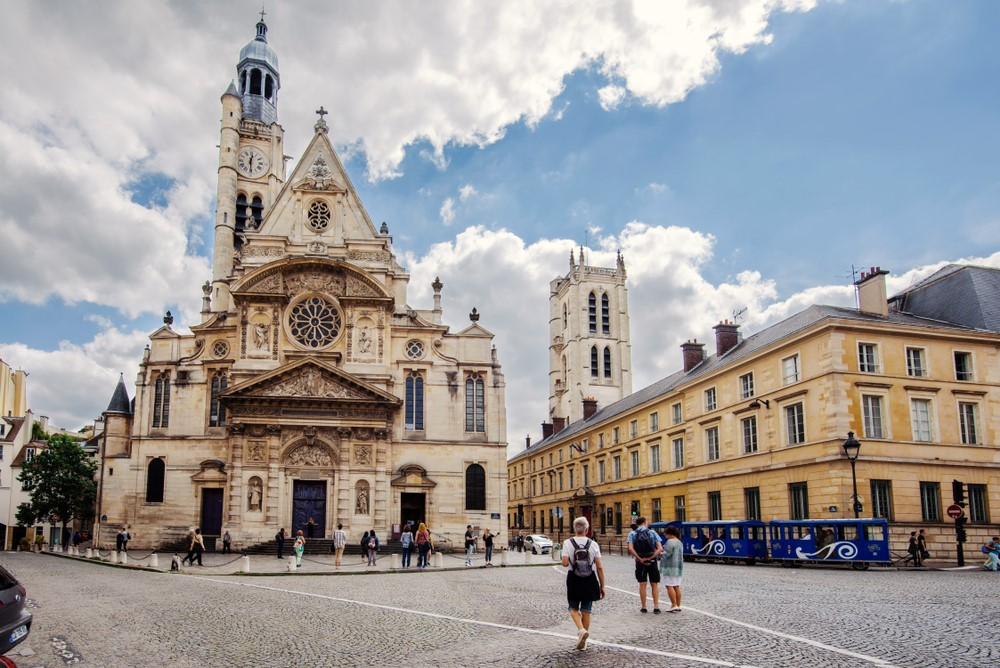

D’après les travaux de Marion Tillous, géographe (2020), 100% des femmes et minorités de genre ont connu de l’inconfort ou de la peur dans les espaces publics et 25% d’entre elles ont  été victimes de violence dans les transports en commun. Cela peut aller des violences verbales aux violences physiques les plus extrêmes. Dans certains contextes politiques, ces espaces sont aussi surveillés, parfois soumis à une présence policière forte et recourant à la violence politique, à laquelle les femmes et minorités de genre sont particulièrement exposées – l’Egypte détient à ce titre le triste record de la violence faite aux femmes dans les espaces publics, 99% des femmes déclarant y avoir déjà subi des violences, celles-ci étant encore plus fortes pour les minorités de genre. L’entrée par le genre interroge donc le caractère universel et pleinement accessible des espaces publics. Il est ici principalement question des espaces publics occidentaux – comprenant les situations européennes principalement, ainsi qu’anglophones et latino-américaines, qui partagent beaucoup de traits communs. Nous nous concentrons également en priorité sur les espaces publics physiques et urbains, en évoquant brièvement les espaces publics virtuels (média, réseaux sociaux, etc.).

Les espaces publics désignent en géographie et pour les aménageurs et aménageuses des espaces ouverts, accessibles et dans lesquels la fréquentation peut se faire par toutes et tous, de façon universelle. Ils s’opposent à l’espace privé, dont l’accès et l’usage peuvent être restreints par leurs propriétaires. Les espaces publics sont souvent pensés selon le modèle de l’agora grecque (Blanchard et al., 2021), c’est-à-dire un espace ouvert, relativement grand et central dans les espaces urbains. Les villes elles-mêmes sont généralement considérées, à une plus large échelle, comme des espaces publics, dans la mesure où elles concentrent beaucoup de personnes, favorisent les rencontres et fonctionnent grâce aux déplacements. Les espaces publics, par-delà cette définition générique, ont pourtant des acceptions très situées historiquement et géographiquement. D’abord, le modèle ouvert et central correspond à une vision occidentalocentrée, voire européocentrée. Ailleurs, comme en Asie par exemple, les espaces publics comprennent aussi une partie des maisons et des cours : la limite entre espaces publics et espaces domestiques et privés y est donc plus labile qu’en Europe. Le centre commercial, pourtant privé, endosse de plus en plus dans le monde le rôle d’espace public : c’est le cas du monde anglophone ou latino-américain. Dans ces contextes, alors que les espaces publics sont en repli, parce qu’ils sont marqués par le danger notamment, les espaces privés s’y substituent. Souvent, les espaces publics sont spontanément pensés comme étant urbains, et leur dimension rurale reste négligée. De nombreux travaux de sociologues ou géographes ont également mis en lumière le caractère sélectif et excluant des espaces publics. Leur accessibilité n’est pas garantie à toutes et tous. Par exemple, les personnes en situation de handicap peuvent avoir du mal à s’y rendre, les sans-abris sont exclus du fait de la généralisation du mobilier anti-sans-abrisme (à travers du mobilier commun comme les bancs publics). Les facteurs de l’âge et du genre renforcent encore cette lecture intersectionnelle des rapports de domination dans les espaces publics.

Quand on croise genre et espaces publics, l’universalité de l’accès est rapidement questionnée. Les femmes et les minorités de genre n’ont en fait qu’un accès réduit aux espaces publics, particulièrement dans des contextes urbains : l’entrée par le genre contribue de ce fait à questionner la définition même de l’espace public. D’abord, parce que d’un point de vue temporel, la fréquentation et la pratique de l’espace sont différentes selon le genre : les femmes, par exemple, ont une pratique intense des espaces publics le matin et en fin d’après-midi principalement, au moment de déposer les enfants à l’école et de se rendre au travail et au moment du retour à la maison. Les hommes, quant à eux, ajoutent à ces moments des temps de loisirs (fin d’après-midi, soirée), qui les rendent plus présents dans les espaces publics. Marianne Blidon (2015) analyse par exemple les terrasses des cafés en France et au Royaume-Uni et y dénombre une population essentiellement masculine, qui occupe ces lieux pendant des plages de temps étendues, alors que les femmes ont davantage tendance à traverser les espaces publics plutôt qu’à y rester longtemps. Si on considère une temporalité longue, celle de la vie, on s’aperçoit que les femmes âgées fréquentent moins les espaces publics, et demeurent davantage dans des espaces domestiques. Ensuite, les différences s’observent aussi sur la nature des déplacements opérés dans l’espace public. Si les hommes ont des trajets plutôt linéaires, d’un point A à un point B, les femmes offrent des trajectoires plus circulatoires. Cela s’explique en grande partie par les motifs de présence dans l’espace public : les femmes étant majoritairement en charge des tâches domestiques (faire les courses) et des fonctions de care (soins des enfants ou des aîné‧es), leurs déplacements s’en trouvent plus complexes. Elles sont aussi plus dépendantes des transports en commun : quand un ménage ne possède qu’une seule voiture, ce sont davantage les hommes qui en ont la jouissance. Enfin, les femmes et minorités de genre sont aussi plus vulnérables dans l’espace public, comme le rappellent les statistiques donnés par Marion Tillous (2020). Si l’idée de la ruelle sombre parcourue de nuit et qui serait génératrice de violence demeure, c’est pourtant bien le jour et dans des espaces souvent fréquentés que les violences s’expriment le plus. Si l’on croise genre et sexualités, il s’avère également que les personnes gays et, plus encore, lesbiennes sont également plus fréquemment victimes de harcèlement ou de violences dans les espaces publics. En France, 55% des personnes LGBT déclarent ainsi avoir été agressées au moins une fois dans leur vie en raison de leur orientation sexuelle ou de leur identité de genre. Plus des deux-tiers développent des stratégies d’évitement ([Fondation Jean Jaurès, 2021](https://www.jean-jaures.org/publication/lutter-contre-les-violences-envers-les-lesbiennes-les-femmes-bi-et-les-personnes-trans/)). Enfin, rappelons également que ce sont les violences commises par des proches et dans des espaces domestiques qui dominent dans les statistiques, quand bien même les espaces publics sont des lieux de danger pour les femmes et minorités de genre et sexuelles. 

Les récents travaux montrent pourtant que les espaces publics sont aussi des lieux de revendication pour les femmes et minorités de genre. Dans les villes, les rues, les avenues et les places accueillent régulièrement des manifestations et des marches des fiertés, portant haut et fort les voix de toutes les identités de genres à exister et à être visibles, mais aussi à revendiquer des droits. En Argentine, par exemple, les marches pour le droit à l’Interruption Volontaire de Grossesse, finalement acquise en 2020, ont rassemblé pendant des mois des centaines de milliers de femmes à Buenos Aires et ailleurs. Les espaces publics peuvent aussi être des lieux de dénonciation des violences faites aux femmes et minorités de genre. C’est le cas des collages contre les féminicides, qui font apparaître sur les murs des grandes villes le nom des victimes. Les réseaux sociaux, en tant qu’espace public virtuel, sont également utilisés pour donner à voir des femmes et minorités de genre et publiciser des revendications, tout en formant un continuum avec les espaces publics physiques. Matérialités et immatérialités s’articulent ici de façon importante. Les différents mouvements au sein de *#Metoo* ont à ce titre largement profité de ces médias, et contribuent aussi à des transformations des espaces publics vécus physiquement. De manière réactionnaire, les espaces publics sont aussi les arènes de celles et ceux qui contrecarrent ces avancées : les mouvements anti-genres aussi se saisissent des espaces publics, à l’instar de la Manif pour tous qui depuis 2013 se déploie dans les rues contre les droits des personnes LGBTQIA+ (contre le droit au mariage pour tous, puis contre l'ouverture de la PMA plus récemment, entre autres).

D’autres initiatives, telles que les marches exploratoires, permettent, d’une autre manière, de réinterroger les espaces publics urbains : souvent à l’initiative de collectifs habitants, au sein des quartiers des grandes métropoles, ces marches donnent l’occasion aux femmes de se réapproprier l’espace public, mais aussi de formuler des demandes auprès des acteurs publics pour aménager l’espace de façon plus inclusive. Ce type de marche identifie par exemple les trottoirs trop étroits pour y circuler avec poussette ou fauteuil roulant, signale les endroits trop peu éclairés la nuit, etc. Ces différentes manifestations dans ou autour des espaces publics rappellent que ceux-ci doivent être co-construits entre aménageur‧euses et habitant.es. Concernant les marges exploratoires, voir notamment [cet ensemble de ressources canadiennes](https://urbanismeparticipatif.ca/outils/marche-exploratoire). Le Canada est en effet à l’origine du dispositif, qui a ensuite essaimé en Europe et dans les Amériques, redonnant de la visibilité aux minorités de genre et de race dans la conception des espaces publics. 

Depuis une vingtaine d’années, les acteurs publics se saisissent de ces enjeux d’inclusion – qui comprennent les enjeux liés au genre, mais pas uniquement, l’âge ou la capacité à se déplacer étant aussi au cœur des réflexions. Dans le réaménagement des places urbaines, par exemple celles de la Madeleine ou du Panthéon à Paris, le mobilier est récemment pensé comme plus accueillant, les espaces dédiés aux voitures sont réduits et les places sont végétalisées, de façon à répondre à la fois aux enjeux d’inclusion et de réchauffement climatique – ces places étant très fortement marquées par les phénomènes d’îlot de chaleur. Penser les espaces publics au prisme du genre conduit en fait à envisager plus largement des espaces plus accessibles et inclusifs. 

Des logiques similaires s’appliquent aussi aux cours de récréation qui, bien que semi-publiques en raison de leur emplacement dans des écoles, reproduisent des logiques spatiales très genrées (Maruéjouls, 2022). Les garçons au centre jouent au ballon, tandis que les filles occupent davantage les espaces périphériques et font des jeux plus calmes et moins mobiles. Certaines villes, telles que Grenoble, repensent les formes des cours, visant à les organiser de façon plus inclusive. Par exemple, les terrains de football ne sont plus placés au centre, mais en périphérie des cours de récréation, et les espaces centraux sont végétalisés et organisés en petits îlots, ce qui autorise d’autres formes d’utilisation. [Une vidéo du site « Matilda »](https://matilda.education/course/view.php?id=218) revient par exemple sur les aménagements des cours de récréation au prisme du genre. Les espaces de loisirs outdoor, tels que les skate-parks, reproduisent également ces logiques (Raibaud, 2015). Les acteurs publics prennent timidement conscience de ces enjeux : au-delà des rapports de domination liés au genre, ce sont en réalité des questions d’inclusion qui entremêlent le genre avec les facteurs de race, de classe ou d’âge. En pensant les espaces publics par le genre, c’est à des espaces plus inclusifs et accueillants que l’on travaille.

## Bibliographie

Blanchard Sophie, Estebanez Jean et Ripoll Fabrice, Géographie sociale. Approches, concepts, exemples. Armand Colin, 2021.

Blidon Marianne, [« Notion à la une : genre »](https://geoconfluences.ens-lyon.fr/informations-scientifiques/a-la-une/notion-a-la-une/notion-a-la-une-genre), Géoconfluences, 2015.

Maruéjouls Edith, *Faire je(u) égal. Penser les espaces à l’école pour inclure tous les enfants*, Double ponctuation, 2022.

Raibaud Yves, *La ville faite par et pour les hommes*, Belin, Paris, 2015.

Tillous Marion, [« Les voitures de métro réservées aux femmes protègent-elles du harcèlement sexuel ? »](https://metropolitiques.eu/Les-voitures-de-metro-reservees-aux-femmes-protegent-elles-du-harcelement.html), *Métropolitiques*, 2020.

