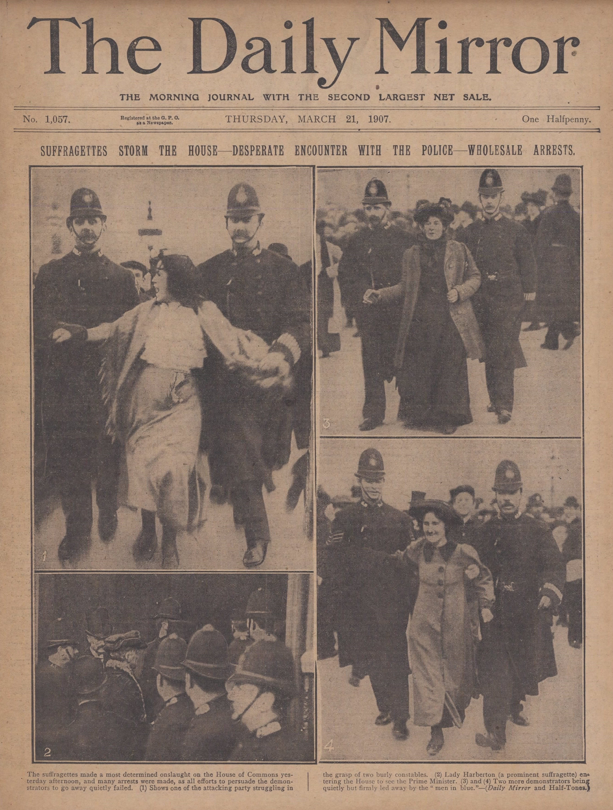
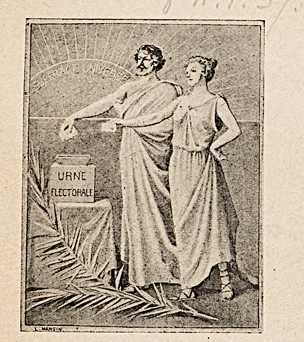

## Le suffragisme : une revendication en faveur de l’égalité

Des discours favorables au vote des femmes émergent en France dès la fin du 18e siècle. Dans *Sur l’admission des femmes au droit de cité* (1790), le philosophe Nicolas de Condorcet fait primer la qualité d’être humain sur le sexe et évoque le rôle de l’éducation dans la construction sociale des femmes.

Les années 1840 constituent un temps de réflexion particulier sur les modalités du droit de vote de chaque côté de l’Atlantique. En France, le vote est alors censitaire, déterminé par le niveau/taux d’imposition des citoyens. Aux États-Unis, il exclut notamment les personnes de couleur. Le suffragisme, en tant que mouvement structuré, naît en 1848 de manière concomitante dans ces deux pays. Le 5 mars, à la suite de l’instauration de la Deuxième République, un décret instaure le suffrage universel pour tous les hommes de nationalité française, âgés de 21 ans ou plus, et jouissant de leurs droits civils et politiques. Les Françaises ne sont pas incluses dans cette réforme. Certaines se regroupent autour de personnalités dont Jeanne Deroin (1805-1894), Eugénie Niboyet (1796-1883) ou Désirée Gay (1810-1897). De nombreuses actions sont menées (pétitions, manifestations…) et quelques femmes rédigent des journaux comme *La Voix des femmes* ou *L’Opinion des femmes*.

La même année 1848, aux États-Unis, la Convention de Seneca Falls est un des premiers rassemblements féministes américains dans l’objectif d’échanger sur les droits des femmes. Si la primauté des droits civils est débattue tandis que d’autres sujets, tel l’abolitionnisme, y tiennent une place plus centrale, les droits politiques sont inclus dans le document conclusif ou « Déclaration des sentiments ». Ce principe de convention féministe se propage ensuite dans tout le pays.

La structuration en de multiples associations donne sa force et sa visibilité au mouvement suffragiste tout en lui permettant de représenter toutes les sensibilités. La revendication du vote des femmes s’exprime en effet de diverses manières : la National Woman Suffrage Association fondée par Elizabeth Cady Stanton (1815-1902) et Susan B. Anthony (1820-1906) en 1869 est plus radicale que l’American Woman Suffrage Association de Lucy Stone (1818-1893) et Henry Blackwell (1825-1909). En France, à la suite du Droit des femmes, association pionnière fondée par Hubertine Auclert (1848-1914) en 1876, on retrouve la même diversité avec la Ligue française pour le droit des femmes, de gauche républicaine et laïque, l’Union française pour le suffrage des femmes, qui se veut politiquement neutre ou encore l’Union nationale pour le vote des femmes, conservatrice et catholique. Au Royaume-Uni, la National Union of Women's Suffrage Societies, créée par Millicent Fawcett (1847-1929) en 1897, est concurrencée dès 1903 par la Women’s Social and Political Union (WSPU) d’Emmeline Pankhurst (1858-1928), qui se radicalise rapidement, créant la distinction entre suffragistes et suffragettes. Les arguments des associations oscillent entre universalisme – femmes et hommes sont égaux en tant qu’humains et doivent l’être en tant que citoyens – et différentialisme, défendant la complémentarité du masculin et du féminin et arguant de la sensibilité des femmes et de leur rôle social spécifique. Ils sont parfois politiques lorsqu’est affirmé l’attachement à la laïcité ou, à l’inverse, au féminisme catholique par exemple, ou à travers la défense des ouvrières.

Il faut noter la puissance du mouvement international en faveur des droits des femmes. Le Conseil international des femmes est créé par des suffragistes états-uniennes en 1888 avant d’essaimer en Europe (Ill. 1). 

](conseil.png)

L’Alliance internationale des femmes, fondée en 1904 lors d’un congrès à Berlin, s’installe à Londres pour défendre spécifiquement les droits politiques féminins. Les rencontres entre militantes font de ces associations des vecteurs de circulation des savoirs et des informations.

## Suffragistes et suffragettes : les suffragistes ont-elles perdu la bataille gagnée par les suffragettes ?

Dans les médias et le vocabulaire courant, le terme « suffragette » a pris le pas sur celui de « suffragiste ». Les deux mots recouvrent pourtant des réalités différentes. Si la revendication centrale est similaire – l’obtention des droits politiques pour les femmes –, les méthodes de lutte et leurs temporalités ne le sont pas. Les suffragistes ont appuyé leur combat sur un strict respect des lois et de l’ordre, preuve de leur volonté d’intégration dans le système politique de leur pays. Outre les actions de propagande (conférences, livres, articles de presse, manifestations autorisées, objets promotionnels…), elles et ils utilisent le lobbying auprès de parlementaires, les pétitions, tentatives d’inscription sur les listes électorales, procès et recours juridiques.

Les suffragettes sont issues du mouvement suffragiste britannique. Un journaliste emploie ce terme pour la première fois en 1906 pour dénigrer des militantes du WSPU. Tout comme « féministe » utilisé contre les militantes françaises dans les années 1870, les Anglaises se le réapproprient avec fierté. Ce groupe durcit ses actions à partir de 1908 et plus particulièrement, entre 1910 et 1914, avec une série d’attentats à la bombe et d’incendies contre des bâtiments publics, des boîtes aux lettres et la résidence d’hommes politiques. Les manifestations sont réprimées avec brutalité : les autorités n’hésitent pas à emprisonner et à nourrir de force les suffragettes pour briser les grèves de la faim (Ill. 2).

Alors qu’aucun autre pays n’a connu la même radicalisation, c’est pourtant « suffragette » qui reste dans les mémoires, donnant l’impression que le droit de vote, enfin obtenu pour les femmes de plus de 30 ans en 1918 au Royaume-Uni, est une victoire qui leur est due. Le débat avait pourtant débuté dès les années 1860 et ce droit, accordé en même temps que le suffrage universel masculin, demeure partiel pour les femmes.

En parallèle, de nombreux pays n’ayant pas connu de mouvement de suffragettes accordent le vote aux femmes au sortir de la Grande Guerre, profitant de la réforme de leurs institutions. C’est le cas des États issus de l’éclatement des empires d’Europe centrale, dont l’Allemagne et la Hongrie, et de la Russie après la Révolution de 1917. Ailleurs, il faut parfois attendre plusieurs années, voire décennies, pour que le droit de vote féminin soit inscrit dans la loi, comme en France en 1944. Les sénateurs français, en particulier les radicaux, avaient brandi l’argument de la stabilité institutionnelle pour refuser une réforme qui, en doublant le corps électoral, aurait pu ébranler le régime.

## Document : Extrait du chapitre « Dégradée civique née », *Le Vote des femmes* d’Hubertine Auclert (1908).

« Aucun homme n’est par son rôle, si infime qu’il soit, exclu des prérogatives de Français et de citoyen, pourquoi donc le rôle des femmes les priverait-il de leurs droits de Françaises et de citoyennes ? La perpétuation de l’espèce humaine, les soins donnés aux affaires domestiques sont-ils moins importants que l’attention apportée à l’exercice d’un métier ? 

[…] On ne peut aujourd’hui faire croire qu’être homme étend les facultés intellectuelles d’un individu et qu’être femme, restreint les facultés intellectuelles d’un autre individu. La maternité que l’on objecte aux revendicatrices ne s’oppose pas plus à l’exercice des droits politiques, qu’elle ne s’oppose à l’exercice d’un art ou d’un commerce. […] Mères ou non, mariées ou non mariées, toutes les femmes doivent exercer leurs droits politiques afin de pouvoir mettre l’ordre dans la commune et dans l’État.

[…] La personne et la condition de la femme dépendant de la politique qui de toute part l'enserre ; dans son propre intérêt comme dans l’intérêt général, la femme doit participer à la vie publique, coopérer à la transformation de la société afin de s’assurer de n’être point sacrifiée en l’organisation sociale future.

[…] Rapprocher hommes et femmes par la politique, ce sera faire s’établir entre les sexes une émulation salutaire pour le progrès. »

Depuis 1870, Hubertine Auclert milite en faveur des droits politiques des femmes. Issue d’un milieu bourgeois de l’Allier, elle découvre le combat féministe dans la presse et monte à Paris pour rejoindre les associations militantes. Elle choisit de se consacrer aux droits de vote et d’éligibilité, devenant pionnière de ce combat à une époque où nombre de féministes privilégiaient la lutte pour les droits civils. En 1908, son livre manifeste, *Le Vote des femmes* (Ill. 3), reprend l’ensemble de ses arguments.

Ce chapitre, intitulé « dégradée civique-née », ouvre l’ouvrage. Cette formule signifie que la femme ne perd pas ses droits civiques du fait d’une mauvaise action, mais dès sa naissance, parce qu’elle naît femme. L’injustice est forte puisqu’elle rappelle, à l’instar de Condorcet, que le vote doit être un droit humain et pas lié au sexe. Elle souligne que les femmes, en ce début de 20e siècle, ont un rôle social essentiel, notamment comme travailleuses. Celui-ci doit être reconnu par l’octroi du vote, qui permet de se défendre.

Néanmoins, au-delà de ces arguments universalistes, elle en mobilise d’autres, plus essentialistes. Elle veut montrer que l’action politique des femmes est nécessaire pour équilibrer la société, en complément de celle des hommes : les femmes auraient, selon elle, une perception du monde différente, plus pertinente, par exemple, pour écrire des lois concernant la vie des femmes et des enfants. Cette co-gestion politique et sociale à égalité entre les femmes et les hommes serait une source de progrès. Auclert se place ainsi dans la lignée de la pensée saint-simonienne du début du 19e siècle.

## Bibliographie

Bijon Béatrice, Delahaye Claire, *Suffragistes et suffragettes : la conquête du droit de vote des femmes au Royaume-Uni et aux États-Unis*, ENS éditions, 2017.

Moalic Anne-Sarah, *La Marche des citoyennes*, Éditions du Cerf, 2021.

Ripa Yannick, *La véritable histoire des femmes : de l'Antiquité à nos jours*, Nouveau monde éditions, 2022.

Stevan Caroline, Braslina Elina, *Citoyennes ! : il était une fois le droit de vote des femmes*, Helvetiq, 2021.
