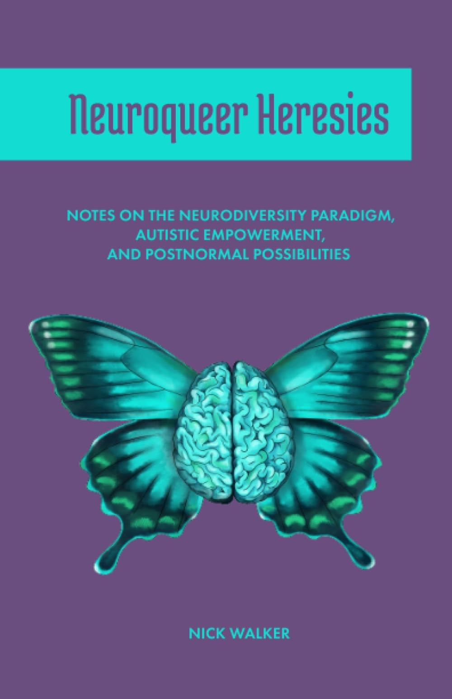

## Neurodiversité, neurodivergence, neuroqueer

Le concept de neurodiversité émerge dans les années 1990 au sein de la communauté pour la vie autonome (*Independent Living*, en anglais), un espace en ligne international constitué en premier lieu par des personnes autistes. Inspiré par la notion de biodiversité et par les différentes formes de diversité sociale (sexuelle, ethnique, culturelle, etc.), il renvoie à la diversité des modes de fonctionnement neurocognitif – et donc, par extension, de styles affectifs, comportementaux et existentiels.

En 2000, l’activiste Kassiane Asasumasu forge le concept de neurodivergence pour désigner des modes de fonctionnement neurocognitifs minorisés, à l’instar de l’autisme, du trouble déficitaire l’attention avec ou sans hyperactivité (ou TDAH), des troubles des apprentissages (dyslexie, dyscalculie, dyspraxie, dysorthographie), de la trisomie 21, de l’épilepsie, des troubles de la personnalité (limite, bipolaire, etc.) et autres fonctionnements psychiatrisés comme la dépression ou le stress post-traumatique. 

Le mouvement de la neurodiversité milite pour l’obtention de droits égaux pour les personnes neurodivergentes, ainsi que pour leur pleine et entière participation à l’ensemble des sphères de la société. Il s’oppose à ce qu’il a appelé le paradigme de la pathologie, qui considère les neurodivergences comme des troubles individuels devant être traités par la psychothérapie, voire « guéris » ou éradiqués par la biomédecine. À ce paradigme neuronormatif s’oppose le paradigme de la neurodiversité, qui soutient que les neurodivergences sont des variations normales et potentiellement désirables. À l’inverse, les personnes dites « neurotypiques » ne sont pas plus « normales » que les personnes neurodivergentes, mais simplement privilégiées par une norme arbitraire qui peut alors être déconstruite. Ce changement de perspective est politique : il montre que c’est l’environnement social, normatif, qui construit certains parcours comme déviants et qu’il est nécessaire de rendre les espaces sociaux plus habitables pour tou•te•s. 

Plus récemment, le concept de « neuroqueer » – lui-même développé collectivement – a permis de décrire et de soutenir les existences des personnes à la fois queer et neurodivergentes (ill. 1). 

![Photographie d’un double arc-en-ciel complet. Le ciel est bleu clair et parsemé de nuages clairs. Une plaine ombragée occupe la partie basse de l’image. Une forêt se dégage à l’horizon. Les deux arcs-en-ciel sont au centre de l’image. Celui du bas est vif et bien visible, celui du haut est moins éclatant et semble lui faire écho. L’image du double arc-en-ciel fait référence à l’intersection entre queerness et neurodivergence. Source : Lauri Kosonen, ‘Full featured double rainbow at Savonlinna’, Licence Creative Commons, [Wikipédia](https://commons.wikimedia.org/wiki/File:Full_featured_double_rainbow_at_Savonlinna_1000px.jpg)](<dble arc en ciel.jpg>)

Plus largement, la théorie neuroqueer s’attache à décrire et résister aux effets croisés de la neuronormativité et de la cishétéronormativité. Læ rhétoricien•ne neuroqueer M. Remi Yergeau s’est ainsi intéressé•e à l’articulation historique entre la queerphobie et l’autismophobie dans les sciences comportementales et les neurosciences. Le développement récent de la perspective neurotrans a également permis de souligner la construction simultanée des thérapies de conversion de genre et des thérapies de conversion destinées aux enfants autistes, qui reposent sur l’analyse appliquée du comportement. À l’instar des thérapies de conversion de genre, cette méthode de reprogrammation comportementale ne guérit » pas l’individu, elle lui apprend simplement à camoufler ses traits autistiques et à performer les comportements attendus.

À l’heure d’une résurgence du fascisme en Occident, les mouvements anti-trans instrumentalisent de plus en plus les personnes neurodivergentes (et notamment autistes) pour justifier l’interdiction des soins d’affirmation de genre aux mineur•es. De même, dans le contexte français, les discours psychanalytiques longtemps dominants continuent d’infuser les mentalités en suggérant une responsabilité des parents, particulièrement des mères, dans l’autisme de leurs enfants. Les perspectives neuroqueer et neurotrans ont un rôle décisif à jouer dans la déconstruction des préjugés cishétérosexistes en lien avec la neurodivergence.

## Vers des pratiques somatiques transformatrices

Le théoricien autiste-trans Nick Walker (ill. 2) s’inspire de perspectives minoritaires en psychologie telles que la psychologie humaniste, somatique et transformatrice pour nourrir la théorie neuroqueer. 

Ces approches permettent de contextualiser les comportements neurodivergents dans l’environnement social et l’expérience vécue de l’individu. Il s’agit ainsi de dénoncer les principes neuronormatifs qui déterminent encore aujourd’hui le traitement des personnes neurodivergentes en individualisant et pathologisant leurs existences. La théorie neuroqueer vise ainsi à transformer les structures sociales dominantes.

À travers sa pratique de l’enseignement de l’aïkido, Walker s’est intéressé à des « pratiques somatiques transformatrices » qui permettent aux personnes neurodivergentes d’exprimer leur corporéité sans avoir à recourir au camouflage de leurs traits neurodivergents ou à d’autres mécanismes de défense. Or, dans la mesure où les revendications sociales des mouvements handicapés en matière d’accessibilité s’avèrent souvent bénéfiques à l’ensemble de la population, ces pratiques somatiques transformatrices portent une ambition qui dépasse le cadre restreint des aménagements du handicap. Dans ce contexte, si l’approche neuroqueer se propose de déconstruire la neuronormativité, elle ne le fait pas de manière identitaire : le mouvement neuroqueer n’est pas la prérogative de personnes neuroqueer et aucun diagnostic n’est nécessaire pour s’en revendiquer. Au contraire, tout le monde peut s’engager dans une démarche de neuroqueerisation.

La théorie neuroqueer met en avant les différentes manières d’être un « corps-esprit » (un concept que les études du handicap ont emprunté à la psychologie somatique). Il ne s’agit pas en cela de célébrer de manière abstraite un principe de diversité, fréquemment récupéré par le capitalisme néolibéral, mais de mettre en cause le primat d’une norme neurocognitive unique et universelle. En ce sens, Walker nous invite à explorer les potentiels queer de la « bizarrerie » : en incarnant des pratiques somatiques neurominoritaires, on contribue à décentrer la norme et à réduire les hiérarchies de fonctionnement neurocognitif.

## Neuroqueeriser les espaces d’apprentissage

Les auteur•ices et militant•es autistes Helen Edgar et Ryan Boren ont appliqué l’approche neuroqueer au contexte pédagogique, en s’intéressant aux espaces d’apprentissage. En s’appuyant sur la logique de la pensée queer (la subversion des normes dominantes et la prolifération des alternatives) davantage que sur son objet (la dissidence sexuelle) iels expliquent que :

[l]a salle de classe contemporaine est un temple de la neuronormativité. Chaque acte dans la lutte pour le droit à apprendre autrement peut être un acte de neuroqueerisation […]. Nous suggérons qu’il est nécessaire de concevoir des espaces d’apprentissage fondamentalement neuroqueer, permettant une « liberté d’incarnation » et une « liberté cognitive ». Nous avons besoin de facilitateur•ice•s de l’apprentissage qui soient capables de « faire de la place » [to be “space holders”], afin que les corps-esprits des enfants soient autorisés à vivre et à apprendre de manière authentique. (Edgar 2024, ma traduction)

Sur cette base, Boren et Edgar proposent de déconstruire l’uniformité des espaces pédagogiques existants, qui ne s’avèrent accessibles qu’à une minorité d’apprenant•es, qu’iels soient neurotypiques ou neurodivergent•es. Partant de la diversité des modes d’attention, de mémorisation et de communication, mais aussi des besoins psychologiques et somatiques, iels nous invitent à remettre les corps au centre des pratiques d’enseignement. Réintroduire du mouvement dans la salle de classe permet ainsi de normaliser les stims (ces mouvements d’autostimulation qui permettent de réguler les émotions, la sensorialité ou l’énergie, et auxquels les personnes autistes recourent assidûment), les tics, les étirements et autres pratiques somatiques qui sont, pour beaucoup de personnes, partie prenante des pratiques d’apprentissage.

De la même manière, prêter attention à la sensorialité permet de contribuer à la mise en accessibilité des espaces d’apprentissage. Dans le contexte pédagogique, où les frictions d’accès – c’est-à-dire l’existence de besoins inconciliables – ne sont pas rares, les hypersensibilités sensorielles s’opposent parfois aux comportements de recherche sensorielle (tels que se balancer sur sa chaise, jouer avec un fidget toy, taper des pieds sur le sol, machouiller son stylo, tapoter sur la table, etc.). Pour y faire face, la perspective neuroqueer ne se contente pas de stratégies individuelles (casques réducteurs de bruit, lunettes de soleil, etc.), mais peut conduire à imaginer des solutions structurelles, telles que l’aménagement de différents espaces et usages au sein (et en dehors) de la salle de classe.

À cet égard, Boren et Edgar développent la notion d’« espaces Cavendish », inspirés par le physicien et chimiste britannique du même nom, qui fut récemment décrit comme une personne potentiellement autiste. Pour ces auteur‧ices, il s’agit d’imaginer des « espaces sensoriellement et psychologiquement sécurisants adaptés au travail en zones, aux états de flow, à la collaboration intermittente et à la construction collaborative de niches » (Boren 2022, ma traduction). On pourra ainsi aménager des espaces de réflexion et d’apprentissage solitaires aux côtés d’espaces plus dynamiques de collaboration, ainsi que des points de rencontre et de transmission des savoirs. Dans ces différents espaces, les positions d’apprentissage et d’enseignement sont redistribuées.
Pour qu’une approche neuroqueer de l’apprentissage soit possible, encore faut-il que les enseignant•es – désormais présenté•es par Edgar et Boren comme des « facilitateur•ices d’apprentissages » – montrent l’exemple. On pourra ainsi commencer par « déclarer l’espace d’apprentissage comme une “zone d’expérimentation libre visant à se défaire des habitudes de performance normative et à explorer, pratiquer, revendiquer et cultiver activement des modes d’incarnation non normatifs” » (Edgar 2024, ma traduction).

## Bibliographie 

Kassiane Asasumasu [Neurodivergent K of Radical Neurodivergence Speaking], [« PSA from the actual coiner of “neurodivergent” »](https://sherlocksflataffect.tumblr.com/post/121295972384/psa-from-the-actual-coiner-of-neurodivergent), Lost in my Mind TARDIS, Tumblr, 2015. 

Ryan Boren, [« Cavendish Space »](https://stimpunks.org/glossary/cavendish-space/), *Stimpunks*, 26 juillet 2022. 

Helen Edgar et Ryan Boren, [« Neuroqueering Learning Spaces »](https://stimpunks.org/projects/neuroqueer-learning-spaces/), *Stimpunks*, s. d. 

Helen Edgar (Autism Realms), [« An Open Framework For Neuroqueer Learning 
Spaces »](https://stimpunks.org/2024/04/28/an-open-framework-for-neuroqueer-learning-spaces/), *Stimpunks*, 28 avril 2024. 

Jake Pyne, [« Temporalités trans, perturbations autistiques. Échapper aux pièges narratifs du
temps »](https://crashroom.ooo/2025/03/19/temporalites-trans-perturbations-autistiques-echapper-aux-pieges-narratifs-du-temps/), traduit par Ombre Tarragnat, CrashRoom, 2025.

Steve Silberman, *NeuroTribus. Autisme : plaidoyer pour la neurodiversité*, traduit de l’anglais (États-Unis) par Anne-Sophie De Clercq et Anne Lemoine, Lausanne, Quanto, 2020.

Nick Walker, [*Transformative Somatic Practices and Autistic Potentials: An Autoethnographic Exploration*](https://neuroqueer.com/wp-content/uploads/2021/07/Nick_Walker_Dissertation.pdf), thèse de doctorat en Études transformatrices, California Institute of Integral Studies, 2019. 

Nick Walker, *Neuroqueer Heresies: Notes on the Neurodiversity Paradigm, Autistic Empowerment, and Postnormal Possibilities*, Fort Worth, Autonomous Press, 2021.

M. Remi Yergeau, *Authoring Autism: On Rhetoric and Neurological Queerness*, Durham et Londres, Duke University Press, 2018. 
