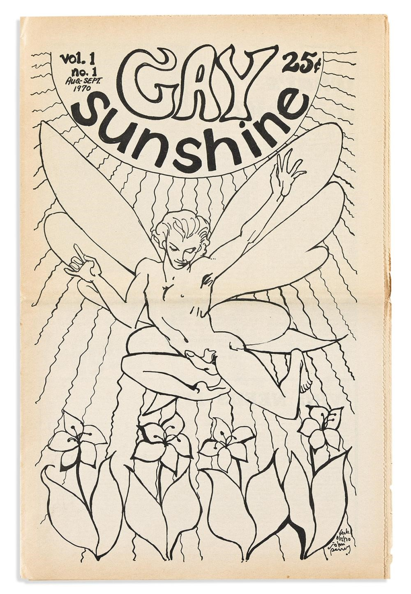
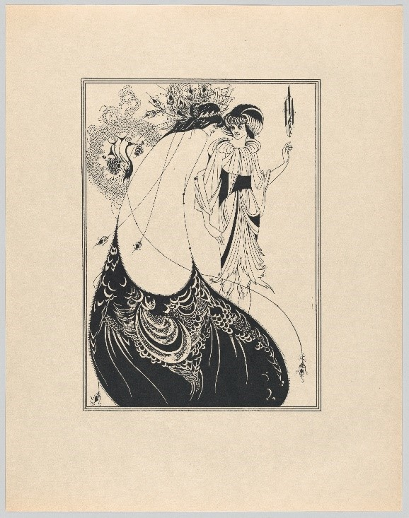
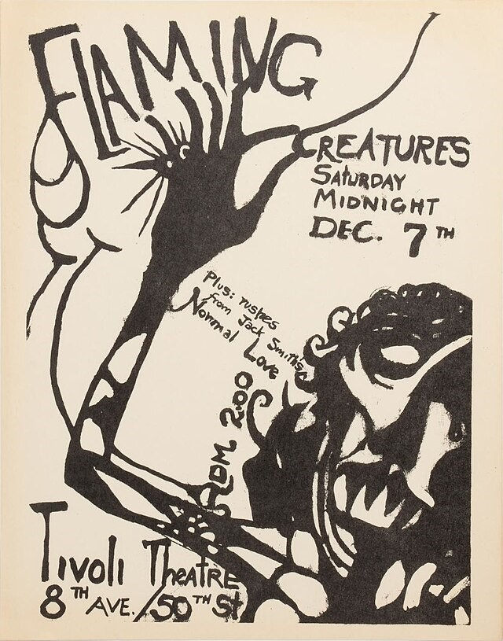

## De l’argot homosexuel à la théorie esthétique : histoire et diffusion du terme

Il est assez délicat de tracer les origines d’un terme d’argot comme celui de camp en raison de sa dimension orale et contre-culturelle. La première occurrence connue de « campish » (une forme adjectivée du mot) a été retrouvée dans une lettre de 1868 écrite par un homme connu sous le nom travesti de « Fanny ». En 1874, le *Manchester Evening News* atteste la diffusion de ce terme dans des milieux homosexuels anglais. Un article relatant l’arrestation de trois hommes travestis indique en effet que l’un d’eux portait sur lui un ticket pour un bal masqué organisé par une certaine « Queen of Camp » (Reine du Camp). Le terme camp apparait ensuite en 1909 dans le dictionnaire d’argot *Passing English of the Victorian Era* qui le définit comme qualifiant « des actions et des gestes d’une emphase exagérée », « principalement usités par des personnes particulièrement en recherche de personnalité » (nous traduisons). Le terme dériverait du français, probablement du verbe « camper », dans le sens de représenter ou incarner un personnage.

L’emploi du terme demeure majoritairement communautaire jusqu’à la publication des « Notes on Camp » de Susan Sontag en 1964. Fort du succès de cet article, le camp connait une postérité importante dans la presse américaine de la seconde moitié des années 1960. On le retrouve en effet employé dans des journaux et magazines grand public, tels que le *New York Times*, le *Times Magazine*, le *Village Voice, Newsweek*, ou encore le *Los Angeles Times*. Considéré le plus souvent comme une sorte de kitsch, le mot est parfois employé pour souligner le mauvais goût du Pop Art, ou encore la métamorphose des comportements sexuels et genrés de la jeunesse américaine de l’époque. Ce terme volatile permet ainsi de souligner le bouleversement des codes sociaux et esthétiques américains durant les Sixties. Outre la presse artistique et grand public, le camp est également discuté dans les pages de journaux homosexuels. En 1970, le *Gay Sunshine* publie des débats sur la pertinence de l’efféminement camp dans un contexte militant d’affirmation homosexuelle (ill. 1). 

De telles sources communautaires attestent de la survivance de conceptions ancrées dans les premiers usages de la notion, en possible confrontation avec la revendication d’une identité homosexuelle virile. L’engouement pour le camp des années 1960 est suivi d’une relative baisse de popularité jusqu’au développement des études queer dans les années 1990. L’anthologie *Camp : Queer Aesthectics and the Performing Subject* (1999) dirigée par Fabio Cleto participe de ce regain d’intérêt pour le camp à travers une approche queer, c’est-à-dire non-essentialiste et antinormative. Enfin, cette notion se diffuse dans d’autres espaces linguistiques. En France, *Le second manifeste camp* (1979) de Patrick Mauriès développe l’aspect aphoristique et les liens avec le dandysme déjà présents dans « Notes on Camp ».

## Deux visions du *camp* : approches esthétiques et socio-historiques

Dans « Notes on Camp », Susan Sontag caractérise le camp comme une sensibilité à la fois tendre et ironique pour des objets qui se distinguent par une forme excessive qui prime sur le fond. Cette conception esthétique a été anticipée par le roman de Christopher Isherwood The World in the Evening (1954), qui considère le camp comme un mode d’expression de sujets sérieux « sous forme de comique, d’artifice et d’élégance ». Par ailleurs, afin d’illustrer son propos, Sontag cite un certain nombre d’exemples hétéroclites : les lampes en verre cloisonné Tiffany, le style Art Nouveau, les dessins d’Aubrey Beardsley (ill. 2), la chanteuse populaire cubaine La Lupe, le film King Kong de Schoedsack et Cooper, ou encore les romans de Ronald Firbank et d’Ivy Compton-Burnett. 

Ainsi mêle-t-elle des œuvres littéraires ou visuelles, des objets, des styles ou des personnalités relevant de la haute culture comme des arts populaires. De prime abord, ces exemples n’ont pas grand-chose en commun, sauf de partager des effets de stylisation particulièrement marqués. Suivant Susan Sontag, le camp est avant tout une manière de voir et, plus encore, de reconsidérer des objets dépréciés par leur soi-disant mauvais-goût ou leur aspect démodé. 

Dans son texte, Susan Sontag aborde très peu la question de l’homosexualité, qui constitue pourtant le contexte d’émergence de cette notion. Sontag souligne que le public du camp se compose majoritairement d’hommes homosexuels mais elle n’en fait pas une catégorie exclusivement homosexuelle. Plus encore, selon l’autrice, le lien du camp avec l’homosexualité repose sur l’idée arbitraire selon laquelle les homosexuels appartiendraient en grande partie à une « aristocratie de goût ». Ce faisant, le regard surplombant de Sontag ne considère pas le fonctionnement social du camp. 

Contrairement à cette approche esthétique, l’ouvrage *Mother Camp* (1972) de la sociologue Esther Newton aborde cette notion à partir d’une enquête menée dans les milieux homosexuels transformistes américains des années 1960. Du fait de cet ancrage sociologique, le camp y est caractérisé en tant que stratégie culturelle fondée sur le fait de « [faire] étalage de son homosexualité » afin d’établir, contre le stigmate, une « identité homosexuelle positive » (nous traduisons). Newton dresse trois grandes caractéristiques du camp visibles dans l’art du drag : l’ « incongruité » (issue du caractère déviant de l’homosexualité), la « théâtralité » (la mise en scène ostentatoire de soi [ou de son personnage] face à un public) et l’ « humour » (prenant la forme d’une auto-parodie). La théorisation du *camp* par Sontag et Newton permet ainsi de dégager deux approches divergentes. D’un côté, une approche esthétique développée à partir de considérations formelles relatives au primat d’une forme excessive sur le fond ; et de l’autre, une analyse des pratiques sociales et des milieux efféminés auxquels le camp est historiquement lié. Cette dichotomie entre approches esthétiques et socio-historiques continue de marquer la plupart des discours sur le camp, qui associent cette notion soit à une forme d’appréciation du kitsch, soit à la contre-culture homosexuelle. 

## Attribution ou endossement du camp ? Les films *Flaming Creatures* de Jack Smith et *Camp* d’Andy Warhol

Les films *Flaming Creatures* (1963) de Jack Smith et *Camp* d’Andy Warhol (1965) sont particulièrement intéressants pour illustrer les dynamiques d’attribution et d’endossement du camp dans le monde de l’art américain des années 1960. *Flaming Creatures* (ill. 3) représente des personnes travesties sous une effusion de costumes et de musiques exotiques. 

*Camp*, quant à lui, constitue une parodie d’émission de variétés comprenant des « numéros » réalisés par des personnalités gravitant autour de l’atelier d’Andy Warhol. Ces deux réalisations reposent ainsi sur des performances filmées. Quelques mois avant la publication des « Notes on Camp », Sontag avait employé cette notion dans son article « A Feast for Open Eyes » (*The Nation*, 13 avril 1964) prenant la défense de Flaming Creatures contre la menace de censure. Alors que ce terme n’est pas revendiqué par Jack Smith lui-même, le mot camp est pourtant associé à son film en raison de son bric-à-brac exotique et stylisé. Le film Camp d’Andy Warhol, lui, endosse pleinement la notion. Le choix de ce titre découle probablement de la popularisation du camp par Sontag. À partir de la publication des « Notes en Camp », le mot camp devient l’une des manifestations d’un dépassement des frontières entre bon et mauvais goût, visible dans le Pop Art. Or, en tant qu’homme homosexuel, Andy Warhol connaissait vraisemblablement les sources socio-historiques de cette notion. Ce film pourrait dès lors représenter des personnalités « campant » leurs propres personnages, de la même manière que le camp peut désigner une appropriation auto-parodique de l’efféminement attribué aux hommes homosexuels.

La signification que nous attribuons au terme camp varie selon que l’artiste se l’approprie ou non. Durant les années 1960, aux Etats-Unis, le camp a en effet été brandi par certains critiques de manière condescendante, afin de rabaisser des œuvres populaires ou associées au Pop art. Dans ce contexte, le terme est plus souvent employé pour qualifier des œuvres qui ne s’en réclament pas. La complexité de cette notion est également liée à son contexte minoritaire. Contrairement à Sontag, de nombreux auteurs l’employant de manière péjorative mettent en valeur ses origines homosexuelles. Dès lors, l’utilisation positive du terme par Warhol dans son film Camp indique peut-être une démarche de réappropriation. L’instabilité sémantique du terme et la diversité de ses usages le rendent difficile à circonscrire. Cette instabilité, que Fabio Cleto revendique comme queer, impose de l’appréhender en lien constant avec son contexte d’usage. Aux Etats-Unis, dans les années 1960, le camp manifeste ainsi la visibilité croissante d’une minorité homosexuelle accueillie non sans réticence par les tenants de l’ordre culturel. 

## Bibliographie

CLETO, Fabio (dir.). *Camp: Queer Aesthetics and the Performing Subject*. Ann Arbor : The University of Michigan Press, 1999.

HANHARDT, John. *The Films of Andy Warhol. Catalogue Raisonné 1963–1965*. Londres : Yale University Press London, 2006.

LEFFINGWELL, Edward (dir.). *Jack Smith: Flaming Creature : His Amazing Life and Times*. Long Island City, N.Y. : Institute for Contemporary Art, 1997.

NEWTON, Esther. *Mother Camp : Female Impersonators in America*. Chicago : University of Chicago Press, 1972. 

SONTAG, Susan. « Notes on "Camp"». *Partisan Review*, automne 1964, p. 515-530.
