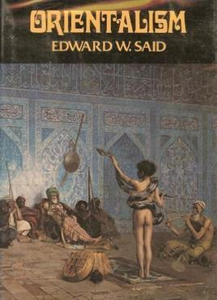
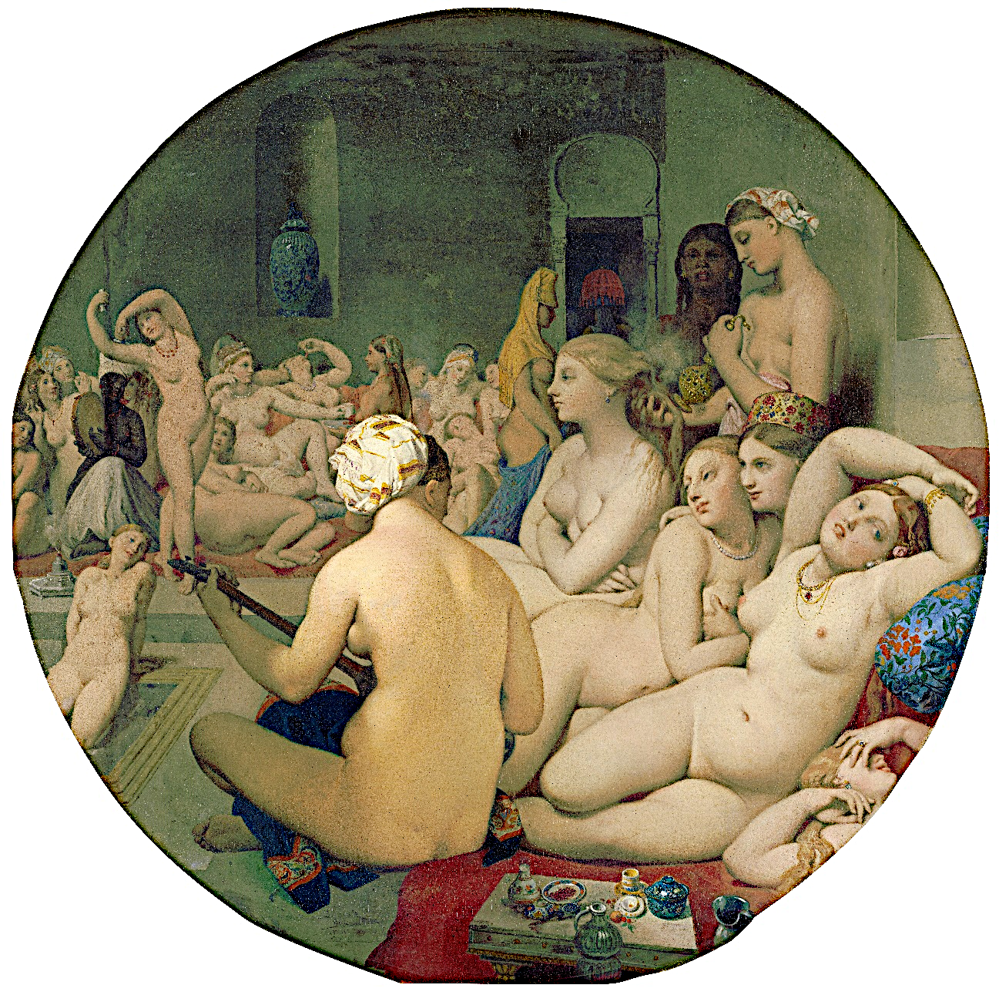
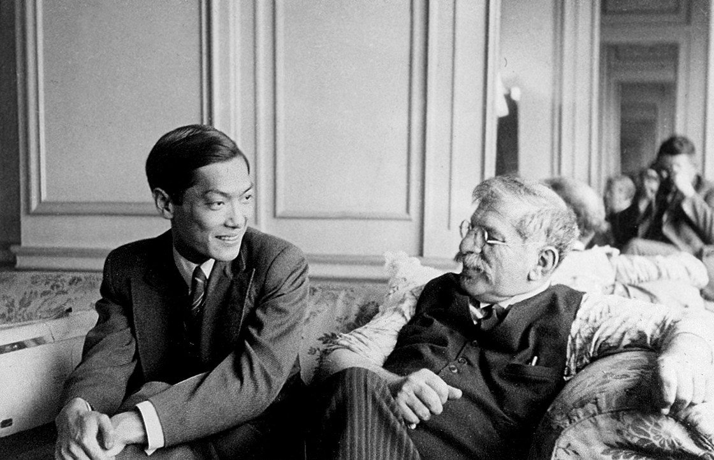

## Définitions et débats

Le terme « orientalisme » désigne un mouvement culturel en Europe initié au 18e siècle, caractérisé par un engouement pour les références orientales notamment dans les arts, la mode et la littérature, ainsi qu’une discipline scientifique portant sur l’étude des langues et sociétés dites « orientales », c’est-à-dire, principalement, d’Afrique du Nord, de l’empire Ottoman et d’Asie. De manière plus critique, il désigne un type de discours qui construit l’Orient comme une géographie imaginée, exotique et subalterne, et comme un « autre », inférieur, vis-à-vis de l’Occident, dans le sillage du livre de l’universitaire palestino-étatsunien Edward Saïd *L'Orientalisme. L'Orient créé par l'Occident* (Ill. 1). 

Saïd souligne l’association de l’Orient à l’exotisme, au mystère, à la spiritualité, à une grandeur, une abondance et une féerie intemporelles, à la lascivité et à la débauche, à la décadence, au primitif, au despotisme et au danger. Ces associations paradoxales sont liées à un désir occidental d’envahir l’Orient, de le domestiquer, de le soumettre, notamment grâce à la connaissance. Elle permettrait métaphoriquement de retirer à l’Orient ses « voiles », objets de fascination, de crainte et de mépris pour les occidentaux. Les pratiques culturelles et la production de savoirs orientalistes ne peuvent, dès lors, se penser en dehors des enjeux de pouvoir au cœur de l’Orientalisme. Pour Saïd, l’orientalisme est le versant idéologique et culturel de l’impérialisme européen.

Si cette définition a souvent été accusée de reproduire une binarité trop stricte et universelle entre Orient et Occident, l’orientalisme n’est pas seulement le fruit d’un regard européen : des acteurs et actrices orientalisés ont participé à la fabrique de ces imaginaires et, en corollaire, de l’Occident. Joseph Massad évoque le rôle d’intermédiaires comme l’historien de la littérature égyptien Ahmad Amîn (1886-1954) qui a voyagé en Europe pour donner des conférences sur l’orientalisme. Amîn condamne la longue histoire de représentations d’amours entre hommes et garçons dans la littérature arabe, nourrissant ainsi des discours moralisateurs européens, tout en défendant l’idée d’un renouveau de la civilisation arabe, qui se déferait notamment d’influences ottomanes et persanes et rejetterait des pratiques considérées comme immorales.

Le cas du Japon, haut lieu de l’imaginaire orientaliste, permet de déstabiliser cette définition. Alors que pour Saïd, les positions de sujet et d’objet sont relativement fixées par les rapports de pouvoir entre une Europe impérialiste et des régions visées par son expansionnisme, Daisuke Nishihara souligne que le Japon, certes imaginé comme « oriental » et confronté aux velléités expansionnistes des puissances coloniales occidentales, était lui-même un agent de l’impérialisme en Asie. Même si elle est objet de critiques, la définition de Saïd reste une référence fondamentale des études postcoloniales.

## Les femmes européennes, actrices de l'orientalisme 

Saïd avait noté que l’orientalisme repose souvent sur une féminisation de l’Orient. Au-delà de cette féminisation symbolique, et de la corrélative masculinisation de l’Occident, les femmes ont été actrices de l’orientalisme. Dans *Women’s Orients: English Women and the Middle East, 1718–1918* (1992), l’historienne Billie Melmann a étudié des récits de voyage de femmes britanniques. Elle remet en question l'idée de représentations homogènes, et masculines, de l’orientalisme en étudiant la manière dont ces récits présentent le « harem ». Les écrivaines britanniques l'évoquent souvent en des termes éloignés des représentations sexualisées et exotiques que l'on trouve dans les écrits et œuvres d’art masculins comme *Le Bain turc* d’Ingres (ill. 2). 

Elles mettent plutôt l'accent sur la vie quotidienne et domestique. Le « harem » apparaît aussi régulièrement comme un contre-modèle aux droits et rôles limités des femmes dans la société européenne, plutôt que comme un symbole de servitude féminine.

L’exemple oriental peut ainsi servir une critique des sociétés européennes et de l’ordre genré. C’est le cas de références à la société birmane, perçue comme matriarcale par certaines féministes britanniques au 19e siècle et au début du 20e siècle, même si celles-ci associent la Birmanie à une société primitive plutôt qu’à un modèle (Delap, « Uneven Orientalisms: Burmese Women and the Feminist Imagination », 2012). L’orientalisme au féminin existe et interagit avec l’orientalisme dominant, masculin, formant ce que Melman appelle une « polyphonie » orientaliste.

## La sexualité dans la « polyphonie » orientaliste

La sexualité constitue une part importante de l’imaginaire orientaliste. Dans l’imaginaire occidental, l’Orient est associé à une sensualité jugée révoltante et exotique. Ce n’est pas par hasard que la couverture de la première édition d’Orientalisme de Saïd représente *Le charmeur de serpent* (Ill. 1), soit un garçon nu, enveloppé d’un serpent, offert au regard d’un public masculin orientalisé. Anne McClintock et Ann Laura Stoler ont montré que la sexualité a été une préoccupation importante des colonisateurs européens et a joué un rôle clé dans l'établissement de distinctions de race, de classe et de genre.

D’un point de vue symbolique, McClintock relève, dans *Imperial Leather: Race, Gender, and Sexuality in the Colonial Contest* (1995), l’imaginaire genré, racialisé et sexualisé qui attise les désirs et les craintes des voyageurs et des conquérants européens, qui qualifiaient les territoires à conquérir de « terres vierges » et les frontières coloniales de limites féminines à franchir. Cette féminisation des terres et des sujets colonisés a stimulé à la fois l’agressivité masculine occidentale mais aussi les angoisses face à des mondes mystérieux et inconnus.

Stoler soutient quant à elle, en étudiant les relations concrètes (travail, domesticité…) dans le cadre colonial, que les femmes ont fait l’objet et participé aux politiques de discipline de la sexualité visant à asseoir la domination coloniale, bien que leur rôle ait varié selon les lieux et les périodes. Alors que le concubinage avec des femmes locales qui assuraient aussi un travail domestique était encouragé dans certains contextes, les femmes européennes blanches étaient, dans d'autres, recrutées dans les colonies comme épouses pour pallier les inquiétudes liées à la pureté raciale et en réponse à la hantise du métissage. Ainsi, la Ligue des femmes de la Société coloniale allemande, organisation civile de promotion du colonialisme fondée en 1907, a soutenu l’émigration de femmes allemandes célibataires vers les colonies, principalement africaines, de l’Allemagne puis vers ces mêmes territoires passés sous le contrôle de la France, du Royaume-Uni et de la Belgique, sous mandat de la Société des Nations, après le traité de Versailles (1919).

## Altérités orientales et sexuelles

Dès l’époque moderne, des récits de voyages européens racontent l’homoérotisme dans le monde islamique, imputant son versant féminin en partie à la ségrégation de genre. Au 19e siècle et au début du 20e siècle, les catégories émergentes de la sexologie européenne, comme l’homosexualité, se nourrissent de tels récits. Si les références à l’homoérotisme oriental peuvent participer à stigmatiser les homosexualités, des actrices et acteurs s’en emparent pour défendre au contraire l’idée qu’elles seraient naturelles et universelles. C’est le cas du sexologue allemand et pionnier de la défense des droits et de la libération homosexuelle Magnus Hirschfeld. Ses travaux reposent sur des données collectées à travers les empires européens, avec son disciple et compagnon Li Shiu Tong, étudiant rencontré à Hong Kong qui devient lui-même sexologue (Ill. 3). 

Hirschfeld fait un usage paradoxal de ces données : tout en affirmant l’universalité de l’homosexualité, il développe l’idée que les peuples colonisés seraient plus représentatifs d’un état de nature dans lequel l’homosexualité serait tolérée. En isolant la question de la libération homosexuelle européenne, il reconduit un discours raciste et impérialiste.

D’autres sources suggèrent pourtant l’émergence de solidarités fondées sur une expérience commune de l’altérité. La spécialiste de littérature et d’études culturelles Leela Gandhi considère que l’anti-impérialisme du britannique Edward Carpenter (1844-1929) et son engagement pour la libération homosexuelle sont inextricables, puisqu’il voyait le « sauvage » et l’homosexuel comme deux « autres » alliés face aux normes dominantes de la « civilisation » occidentale. Dans *Intermediate types among primitive folk* (1914), il dénonce la « cruauté des conquérants espagnols parmi les tribus indiennes - qui n'a apparemment d'équivalent que celle du mercantilisme moderne » et la persécution chrétienne de l’homosexualité, les contrastant à ceux qu’il qualifie de  « peuples primitifs » qui honorent souvent les homosexuels, « intermédiaires » ou « hermaphrodites ». L’orientalisme a ainsi joué un rôle clef dans la formation des sexualités occidentales, forgeant de nouvelles catégories et subjectivités.

## Bibliographie

DAKHLIA, Jocelyne. *Harems et Sultans. Genre et despotisme au Maroc et ailluers, XIVe-XXe siècles*, Anacharsis, 2024.

GANDHI, Leela. *Affective Communities: Anticolonial Thought, Fin-de-Siècle Radicalism, and the Politics of Friendship. Politics, History, and Culture*, Duke University Press, 2006.

MCCLINTOCK Anne. *Imperial Leather: Race, Gender, and Sexuality in the Colonial Contest*, Routledge, 1995.

MARHOEFER, Laurie, *Racism and the Making of Gay Rights, A Sexologist, His Student, and the Empire of Queer Love*, University of Toronto Press, 2022.

MASSAD, Joseph. *Desiring Arabs*. University of Chicago Press, 2007.

STOLER, Ann Laura. *La chair de l’empire: savoirs intimes et pouvoirs raciaux en régime colonial*. La Découverte, 2013.
