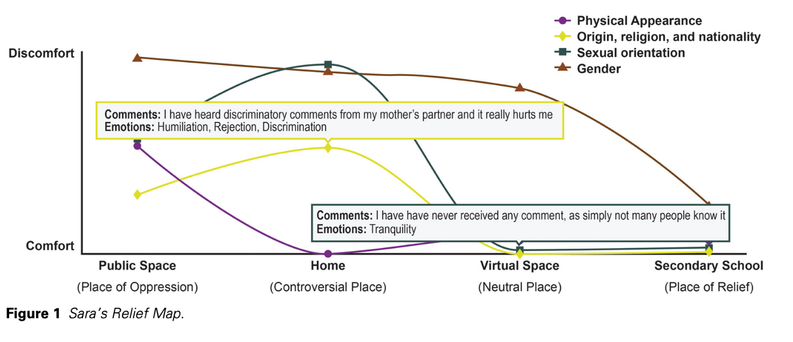
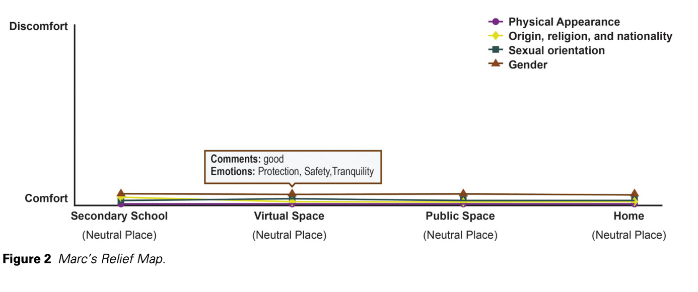

## L’intersectionnalité : une histoire d’abord militante 

La démarche intersectionnelle démarre bien avant l’invention du terme par la juriste Kimberlé Crenshaw en 1989. Dans les années 1960 et 1970 aux États-Unis, de nombreuses femmes racisées dénoncent leur marginalisation au sein des mouvements sociaux : elles constatent que leur expérience n’est pas ou peu prise en compte par les mouvements féministes, majoritairement blancs, et par les mouvements pour les droits civiques, majoritairement masculins. De nombreuses militantes afro-étasuniennes et chicanas coopèrent pour construire une théorie et des pratiques politiques exprimant la spécificité de leur oppression. Certaines s’organisent en collectifs non mixtes, comme le Combahee River Collective, qui publie en 1977 un manifeste qui revendique la position spécifique de ses membres en tant femmes noires lesbiennes : « Nous pensons que la politique sexuelle, sous le patriarcat, joue un rôle aussi important dans la vie des femmes Noires que les politiques de classe et de race. Souvent aussi, nous avons du mal à séparer les oppressions de race, de classe et de sexe, parce que fréquemment, dans nos vies, nous en faisons l’expérience simultanée ».  

C’est à partir de ces discours militants, fondés sur des expériences situées et imbriquées de l’oppression, que le concept d’intersectionnalité est formulé dans le champ universitaire par la juriste afro-étasunienne Kimberlé Crenshaw en 1989. La diffusion du concept d’intersectionnalité dans le champ universitaire étasunien puis mondial est rapide, témoignant de son intérêt pour décrire le monde social. Cependant, sa popularité s’accompagne parfois d’un décentrement par rapport au projet politique du *Black Feminism*. Le chercheur Evé Mayenga démontre que le concept, lors de sa réception en France, est blanchi : il est davantage placé dans le cadre théorique du féminisme matérialiste, et rapproché de la « consubstantialité des rapports sociaux » théorisée dans les années 1970 par la sociologue Danièle Kergoat, qui souligne plutôt les articulations entre genre et classe dans le contexte du travail. 

## Le rôle de l’espace dans la conceptualisation de l’intersectionnalité

Dès sa formulation par la pensée féministe noire, l’intersectionnalité est un concept profondément spatial : le pouvoir est d’emblée pensé dans/à partir de son inscription dans l’espace. Le travail pionnier de Kimberlé Crenshaw sur les refuges pour femmes victimes de violences mobilise à la fois les échelles du corps, de l’espace domestique et de l’État. Elle montre que les oppressions structurelles sont maintenues, reproduites et exprimées à travers des espaces particuliers (la prison, l’usine, le refuge). Dans son essai sur le foyer comme espace de résistance, l’essayiste et théoricienne africaine-étasunienne bell hooks montre comment, pour les femmes Noires étasuniennes, l’espace domestique et familial peut être un espace de répit et de solidarité après une journée de travail passée dans des espaces racistes. Sans nier qu’il puisse être le lieu d’une exploitation de leur travail par les hommes de leur famille, elle relativise ainsi la dénonciation féroce par les féministes blanches majoritaires de l’espace domestique comme espace d’enfermement et d’ennui pour les femmes blanches des classes moyennes. 

Il faut donc tenir compte de l’importance de l’espace dans les processus de formation des subjectivités : on parle souvent d’identités « situées » de façon métaphorique. Or, elles le sont aussi de façon littérale et matérielle. 

La sociologue Nira Yuval-Davis part de ce constat pour former le concept d’intersectionnalité située : elle explique ainsi que non seulement les catégories et leurs significations sociales s’expriment différemment dans différents types d’espaces, mais qu’elles sont produites dans et par l’espace. Elles s’appuient sur un système de classement qui produit de l’altérisation en signifiant aux personnes qu’elles sont, ou ne sont pas, « à leur place ». 

La spatialisation de l’intersectionnalité permet en outre d’éviter le contresens qui fait de ce concept une réification essentialiste des rapports sociaux, fondés sur des identités figées et immuables. Au contraire, prendre en compte les espaces dans et par lesquels se déploient les rapports sociaux permet d’en faire une analyse à la fois dynamique et située, qui prend en compte à la fois le vécu individuel et les structures sociales. 

## Cartographier l'intersectionnalité ? Les « relief maps » de Maria Rodó-Zárate 

Partant de ce constat, comment représenter visuellement les positions multiples que chacun·e occupe dans le monde social en fonction des espaces ? Comment, en géographe, cartographier l’intersectionnalité des dominations ?

C’est à cette question que la géographe et activiste féministe Maria Rodó-Zárate cherche à répondre en proposant la méthode des « Relief Maps », qui permettent de collecter, analyser et représenter des données intersectionnelles. Lors de son doctorat, elle étudie le rapport de la jeunesse aux espaces publics dans la ville de Manresa, en Catalogne : face à la grande diversité des participant·es en termes d’âge, de genre, d’orientation sexuelle, de racialisation et de classe sociale, elle crée d’abord un outil papier destiné à être utilisé par les participant·es elleux-mêmes. Les personnes se situent sur deux axes, l’un représentant le degré de confort (associé au sentiment d’être « à sa place »), l’autre les différents espaces fréquentés. En fonction des émotions ressenties dans la fréquentation de ces lieux et des commentaires, insultes, agressions reçues, la chercheuse peut établir des courbes, dont chaque couleur représente une catégorisation sociale. Le graphique permet de voir comment celles-ci interagissent entre elles et avec différents contextes socio-spatiaux. Les catégories sociales sont utilisées de manière dynamique et non essentialisante, car ce ne sont pas les catégories elles-mêmes mais les rapports de pouvoir qui sont représentés. L’autre intérêt des Relief Maps est qu’elles permettent de représenter le croisement des oppressions (figure 1), mais aussi des privilèges (figure 2), en fonction des contextes et des caractéristiques des participant·es.

Les "relief maps" de Sara et Marc, © Maria Rodó de Zárate. Issues de : Rodó de Zárate, Maria. (2023). [Intersectionality and the Spatiality of Emotions in Feminist Research](https://doi.org/10.1080/00330124.2022.2075406). *The Professional Geographer*, 75(4), 676 681. 

Maria Rodó-Zárate a développé une [version digitale de son outil, ReliefMaps+](https://reliefmaps.upf.edu), accessible à tous·tes. Cette plate-forme permet aux chercheur·euses de créer leur propre projet, de collecter des données et de les représenter sous forme de Relief Maps. 
