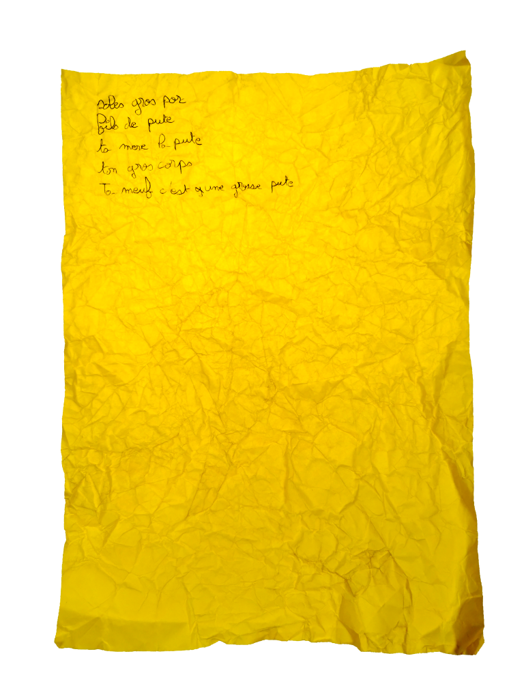
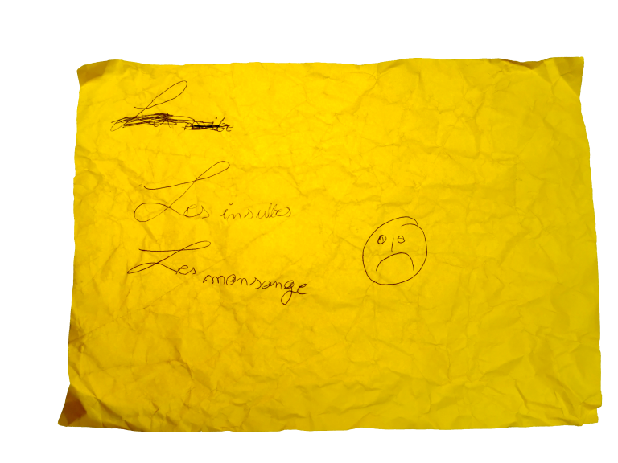
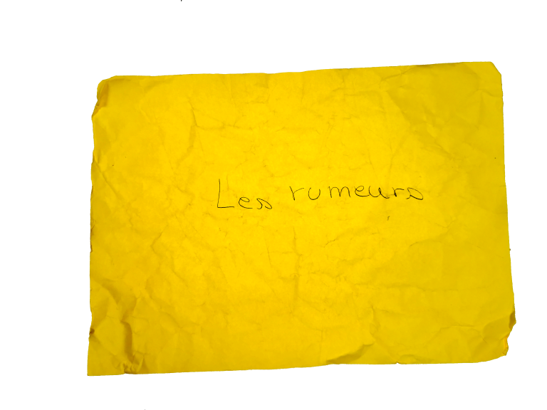
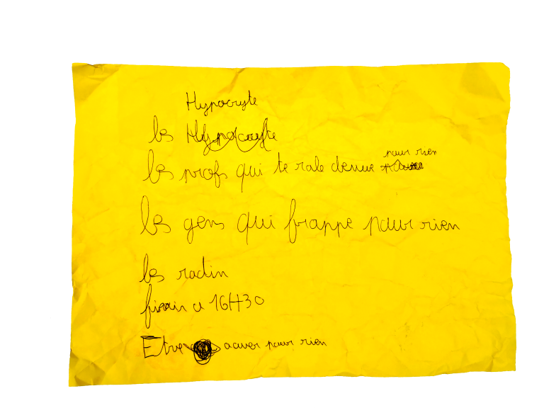
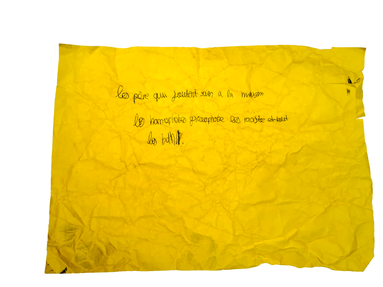

## CONTEXTE

Au cours de l’année scolaire 2023-2024, je suis intervenue à la demande d’un lycée professionnel de région parisienne sur « les inégalités entre les filles et les garçons ». L’atelier, de deux heures environ, a eu lieu dans une salle de cours de type amphithéâtre auprès d’une classe de 3ème Prépa métiers composée d’une vingtaine d’élèves. Pour faire un pas sur leur propre terrain, j’ai cherché à capter leur attention à travers mon métier. « Anthropologue » : un mot bien compliqué dont plusieurs ont eu l’intuition du sens. J’ai introduit mes recherches à travers un objet, connu par certain·e·s, à savoir un tissu pagne (wax). A leur tour, iels en avaient aussi préparé en lien avec leur potentiel futur métier comme des louches, des casseroles, du matériel cosmétique… On a fait connaissance via la matérialité. 

Ensuite, j’ai expliqué pourquoi je m’intéressais au sujet du travail des femmes. Je suis partie d’un constat personnel : j’ai toujours été en colère, depuis petite, de voir que ma grand-mère et ma mère faisaient tout à la maison. Pourtant, leur travail n’était pas valorisé. J’ai expliqué que c’était important de chercher à comprendre pourquoi et comment. Nous avons mis en discussion le caractère multiforme du travail afin que le travail gratuit et non-rémunéré soit revalorisé. Le plus souvent, au départ, les élèves ne se représentent pas le travail domestique et reproductif comme étant du travail.

Je leur ai proposé également de partir de ce qui les mettait en colère afin de les faire entrer par la porte du sensible dans la thématique des rapports de pouvoir et des constructions sociales. J’ai intitulé cette activité « boules de nerfs », en référence positive notamment à une expression qui peut stigmatiser habituellement les personnes qui ne tiennent pas en place en cours ou qui sont constamment en colère. Ce jour-là on avait le droit de l’être.   

## EMBOULEMENT 

Concrètement, j’ai distribué des papiers jaunes, tels que les deux présents en introduction. Je leur ai demandé de déposer sur la feuille ce qui les énervait, soit par la pensée (pour les personnes qui ne sont pas à l’aise avec l’écrit et pour s’éloigner des normes scolaires) ou avec leur stylo. Je n’ai pas donné d’exemple, bien que ma colère initiale sur le travail gratuit des femmes ait pu orienter des réponses. Ensuite, les élèves ont mis en boules leur papier et les ont jetées à distance dans une poubelle. 

« Ça fait du bien ! », iels ont dit.  

Parler de sa famille, légitimer la colère, se donner le droit de ne pas écrire si on ne veut pas, jeter des projectiles dans la classe, écrire ce que l’on veut comme on veut… Un cadre de liberté et de confiance était posé. 

Les visuels qui composent cette contribution reprennent plusieurs de leurs réponses. 

Les boules ont été ouvertes après coup, lorsque j’étais seule à mon domicile. Pendant la séance, on s’était accordé, d’une part, de ne pas les lire en classe et d’autre part, qu’il m’était autorisé de le faire plus tard. Personne ne s’est opposé à ces deux propositions. Ce fut l’occasion d’introduire la notion de consentement. Comme personne ne voulait que les boules soient dépliées devant tout le monde, le consentement prenait une dimension urgente : il ne fallait pas ouvrir. C’était non. Je leur ai suggéré de se souvenir de cette sensation d’impératif le jour où quelqu’un nous dirait non à l’avenir. 

## INTENTIONS DE LA PUBLICATION

La première intention est de donner à voir, sans reformulation, des motifs de colère  d’adolescent·es. Leurs textes informent de sujets qui les préoccupent intimement, qui sont le plus souvent partagés et modelés par des rapports sociaux et politiques. Les réponses donnent des indications sur les vécus des discriminations et les violences peu ou pas exprimées. Certaines choquent. Elles donnent envie de prendre soin. Elles doivent être prises en compte pour changer les normes et les comportements en partant des vécus des jeunes. 

Ces réponses sont des matières à penser, à agir, à faire confiance aux jeunes qui peuvent se politiser à partir de leurs expériences intimes. L’atelier visait à accompagner les élèves à s’appuyer sur leurs savoirs expérientiels et/ou politiques, théoriques, pour en dégager des mécanismes sociaux, des schémas explicatifs et des notions à connaître pour vivre bien, ensemble et dans le respect. Prendre conscience collectivement. L’idée était de concourir à une réappropriation politique de la colère, sans pour autant affirmer qu’elle est la seule émotion légitime dans la lutte. Il s’agissait de mettre l’accent sur le fait que c’est un bon point de départ pour penser l’ordre dominant. 

Une autre intention est de rappeler que de tels espaces de discussion sont indispensables. Ils doivent être plus fréquents notamment dans l’enceinte scolaire. C’est une condition d’un meilleur bien-être des élèves tout court, à l’école spécifiquement où, la plupart du temps, l’expression des émotions et des mécontentements n’est pas la bienvenue. D’un point de vue du genre, c’est participer à une rupture avec des constructions virilistes, annihilant les émotions, qui prévalent socialement et dans les normes scolaires. En creux, cette publication fait la promotion d’une école qui s’adapte aux élèves. Non pas l’inverse. 

La dernière intention est de partager modestement une proposition pédagogique de sensibilisation aux inégalités, aux discriminations afin de rentrer en dialogue avec des personnes qui ont des pratiques similaires ou différentes.

C’est une liste des insultes qui touchent le lycéen. Elles condensent des propos grossophobes et sexistes d’une grande violence. Sur ma proposition d’exprimer tout haut ce que l’on avait écrit ou déposé sur le papier, le lycéen a restitué le contenu de sa liste (de mémoire, après avoir lancé sa boule) en précisant qu’il était blessé parfois par ces propos. S’en est suivie une conversation sur la portée des mots de tous les jours, que l’on croit insignifiants ou drôles, ainsi que sur la discrimination – ses causes et conséquences. Les insultes reviennent dans de nombreux textes d’élèves. C’est un mode d’expression au quotidien. Juste avant l’atelier, il y avait eu une bagarre devant le lycée. Il était important de mettre pause sur cette manière de se parler afin de réfléchir ensemble à ce que cela produit chez tout le monde. Par ailleurs, de s’attarder sur la place des femmes, des mères et de la sexualité féminine dans les insultes.

