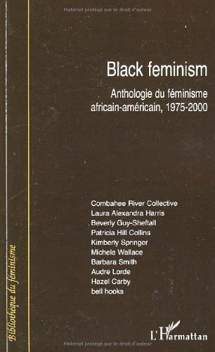

Enseignant les littératures francophones et travaillant très fréquemment sur des textes ayant une dimension antiraciste, j’ai remarqué qu’il était parfois délicat de dénoncer la misogynie de certains de ces textes. Comme s’il existait en moi le désir d’une solidarité des luttes. Si j’écris aujourd’hui ce billet, c’est parce qu’il m’a semblé que ce désir était partagé par bon nombre d’étudiant‧es, et pouvait parfois entraver leur lecture des textes. 

J’ai constaté que faire étudier les féminismes africains-américains permettait montrer la complexité des phénomènes d’oppression et rendait possible l’étude de textes à la fois anti-racistes et sexistes. 

L’étude des féminismes africains-américains permet de montrer la façon dont les luttes pour les droits civiques et les luttes féministes des femmes noires ont été mises en concurrence, et comment certaines militantes africaines-américaines racontent avoir été incitées à secondariser leurs ambitions féministes au profit de la lutte antiraciste. À ce propos, on se réfèrera à la préface de l’anthologie d’Elsa Dorlin, *Black feminism, anthologie du féminisme africain-américain, 1975-2000*. 

Afin de montrer que ce type de processus concerne aussi le présent, on peut renvoyer au chapitre 8 du livre d’Hélène Breda intitulé *Les Féminismes à l’ère d’internet*. Elle montre que les afroféministes françaises qui s’expriment majoritairement sur le net problématisent cette question, en évoquant leur crainte que leur dénonciation du sexisme des hommes noirs soit reprise et instrumentalisée pour justifier des propos racistes. Elle montre ainsi comment le terme de « misogynoir », forgé par la militante africaine-américaine Moya Bailey, est popularisé en France par Laura Nsafou sur son blog ; comment le terme « Pimprenelle », qui permet de dénoncer la tendance de certaines femmes blanches à revendiquer leur fragilité supposée pour disqualifier les paroles des femmes noires dans les espaces publics ou professionnels, a été popularisé sur Twitter par l’autrice Marie Dasylva. 

Si l’objet du cours le permet, on lira aussi avec profit les autrices racisées francophones qui mettent en scène de tels conflits, comme ceux de Calixthe Beyala (*Comment cuisiner son mari à l’africaine ?*), Léonora Miano (*Crépuscule du tourment*) ou Ken Bugul (*Riwan ou le chemin de sable*). Ces textes étant romanesques, ils obéissent aux exigences du genre et de la fiction : ce ne sont pas des essais, et on aurait tort d’y rechercher des thèses clairement exprimées et étayées. Ils permettent par contre de susciter un sentiment d’empathie fort pour des femmes soumises au racisme et au sexisme.  

La lecture de textes antiracistes et sexistes (je travaille beaucoup sur le rap français, et les exemples ne manquent pas) permettent alors d’aider les étudiant‧es à saisir l’intersectionnalité des oppressions autrement que depuis le point de vue de la victime des oppressions combinées. Il me semble important de faire comprendre aux étudiant‧es qu’on peut être à la fois opprimé•e et oppresseur•euse. À ce sujet, toujours dans l’anthologie d’Elsa Dorlin, on lira avec profit l’extrait d’un article de Barbara Smith, « Racisme et études féministes », aux pages 81-86, où on lit (p. 83) :
« Ce n’est pas la faute des blanches si, du fait de leur éducation, elles ne savent pas comment parler aux Noires – comment nous regarder dans les yeux et rire avec nous. Le patriarcat blanc nous a laissé en héritage le racisme et les comportements racistes. En revanche, le fait que vous ne fassiez pas d’effort sérieux pour changer les vieilles formes méprisantes – que sans vous en apercevoir vous continuiez à vous croire supérieures aux femmes du Tiers-monde et à communiquer cette attitude ouvertement ou plus subtilement – cela, oui, c’est de votre faute ».  

Cette idée peut être déstabilisante, parce qu’elle va contre un réflexe intellectuel manichéen, mais permet aussi de désessentialiser les positions d’oppresseur‧euses ou de victimes. Une fois ces rapprochements effectués, il devient assez simple de montrer les mécanismes sexistes d’un texte antiraciste, une fois acquise l’idée qu’il ne suffit pas d’être victime pour cesser d’être bourreau. Je crois qu’on peut alors être assez transparente en tant qu’enseignante, et exprimer simplement la dimension sexiste du texte. Mes corpus de cours font que je n’ai pas été confrontée à la situation inverse, c’est-à-dire à la lecture d’un texte à la fois féministe et raciste. Il me semble que le passage par la lecture et l’étude des productions des féministes racisées donneraient aussi des outils intellectuels efficaces pour penser et enseigner ces questions. 

## Références citées

Hélène Breda, *Les féminismes à l’ère d’Internet : Lutter entre anciens et nouveaux espaces médiatiques*, Paris, Institut National de l'Audiovisuel (INA), 2022. 

Elsa Dorlin, *Black feminism, anthologie du féminisme africain-américain, 1975-2000*, Paris, L’Harmattan, 2008. 

Calixthe Beyala, *Comment cuisiner son mari à l’africaine*, Paris, Albin Michel, 2000. 

Léonora Miano, *Crépuscule du tourment*, Paris, Grasset, 2016. 

Ken Bugul, *Riwan ou le chemin de sable*, Paris, Présence africaine, 1999. 

## Pour prolonger 

Combahee River Collective and Jules Falquet, “Le Combahee River Collective, pionnier du féminisme Noir”, *Les cahiers du CEDREF*, 14 | 2006.

Laura Nsafou, [Hommes noirs, femmes noirtes : une misogynoir née avant la honte](https://mrsroots.fr/2015/05/15/hommes-noirs-femmes-noirtes-une-misogynoir-nee-avant-la-honte/) – Mrs Roots

Rokhaya Diallo et Grace Ly, [Littérature et colonialisme : écrire les vies enfouies](https://www.binge.audio/podcast/kiffetarace/litterature-et-colonialisme-ecrire-les-vies-enfouies) - Kiffe ta race - Binge Audio, 2022
