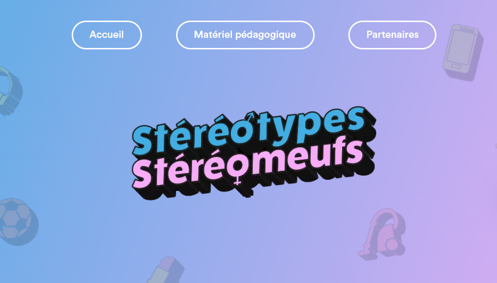

---
uuid: 9f145f7f-ecb2-45d4-b8a5-6e245c0d5c8a

title: "Déconstruire les stéréotypes liés au genre"
author: 
    - Heta Rundgren
tags:
- scénario péda/exercices

image: data/2_cards_astuces/2026-03-04_stereomeufs/stereomeufs.PNG
----

[Genre-en-cours recommande cette ressource](https://www.stereotypestereomeuf.fr/)

## QUI : 

Site lancé en 2018 par ADOSEN Prévention Santé MGEN, en partenariat notamment avec ARTE.
 
## QUOI : 

Quatre saisons d’épisodes courts (3 à 5 mn) dont une grande partie co-écrite avec des collégien·nes ou des étudiant·es. Chaque saison a un guide pédagogique téléchargeable gratuitement avec des activités à animer en classe.
 
Les sujets touchent aux stéréotypes rencontrés dans différents espaces (travail, famille, sport, école, université) ; qui affectent les relations familiales, amoureuses ou amicales ; qui produisent des violences et/ou du harcèlement.
 
## USAGE : 

Pour débuter un travail avec les stéréotypes, commencer à comprendre les inégalités et les oppressions. Les épisodes sont à visionner en ligne et chaque saison vient avec un guide pédagogique téléchargeable qui contient des fiches pédagogiques détaillant plusieurs activités à mener en classe ainsi que de courts textes qui « vulgarisent » le topos. Les activités qui s’adressent aux lycéen·nes sont tout à fait adaptables en licence.
 
## EXTRAIT du guide pédagogique de la saison 1 :

Activité (lycée) : Dictionnaire – Recherche de définitions.
Matériel nécessaire : Dictionnaires d’éditions et de dates de parution différents (1 par élève)
 
PHASE 1 : INDIVIDUELLE ET ÉCRITE (20 mn)

Déroulé : La classe est divisée en 4 groupes.
L’enseignant.e demande aux élèves de rechercher les définitions des mots suivants et de les recopier sur une feuille. Ravissant, robuste,
concentrer, initiative, bavard, luge, essuyer, méthode, débrouillard, mignon, buissonnière, émotif, retourner, imagination, civet, bosse,
vocation, crâneur, élégant, concentrer.

PHASE 2 : COLLECTIVE ET ORALE (20 mn)

Déroulé : L’enseignant.e demande aux élèves d’écouter les définitions lues, de réfléchir et d’argumenter pour savoir si elles sont plutôt
adressées à une fille ou à un garçon. Classer les définitions en argumentant (être attentif à la date de parution des dictionnaires),
commenter ce qui est positif ou négatif. Comparer 2 éditions d’un même dictionnaire et voir s’il y a maintien ou évolution sur les
stéréotypes féminins et masculins.

PHASES 3 : GROUPES DE 2 ÉLÈVES, TRAVAIL ÉCRIT (20 mn)

Déroulé : Pour chaque définition, trouver un ou deux exemples loin des stéréotypes de sexe (exemples neutres ou mixtes).
Durée : 20 mins.